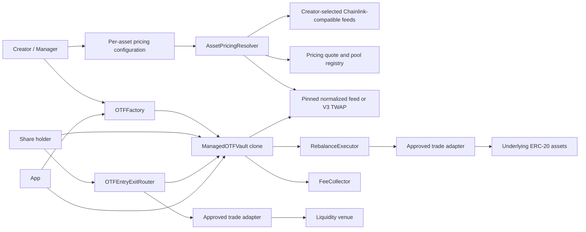

# Onchain Traded Funds

Repository/package folder: `onchaintradedfunds`.

Onchain Traded Funds, abbreviated OTF, is an experimental MVP for permissionless onchain investment
vaults backed by mechanically valid, exactly-18-decimal, exact-transfer ERC-20 assets. Each vault is
an ERC-20 share token and a custodian of its own underlying basket. Managers can rebalance, but only
through a narrow, safety-checked execution path.

This code is not audited, not production ready, and must not be deployed to mainnet.

The normative contract invariants and deployment gates are defined in
[`docs/PROTOCOL_SECURITY_SPEC.md`](./docs/PROTOCOL_SECURITY_SPEC.md). The threat model and known
limitations are documented in [`SECURITY.md`](./SECURITY.md). A reproducible outside-review scope
is available in
[`docs/INDEPENDENT_SECURITY_REVIEW.md`](./docs/INDEPENDENT_SECURITY_REVIEW.md).

## Current Scope

This repository currently implements the first MVP slice:

- Foundry-style Solidity project structure.
- Vault, factory, registry, oracle, executor, fee collector, and mock contracts.
- Fixed minimum rebalance cooldown model.
- Direct basket vault creation through the factory.
- Proportional mint and redeem logic.
- Atomic USDG or WETH entry and exit through one token-agnostic router and approved trade adapters.
- Lazy share-based management fee accrual.
- Optional OTF-token holding rebates and a fixed-supply protocol token.
- Onchain strategy history binding rationales to target snapshots.
- Oracle-valued NAV and weight checks.
- Approved-adapter rebalance execution.
- Comprehensive Foundry unit, fuzz, and stateful invariant tests.
- Next.js app with RainbowKit, wagmi, viem, and TanStack Query.
- A DeFi-style vault dashboard that reads directly from vault contracts.

## Repository Layout

```text
/
|-- contracts/
|   |-- src/
|   |   |-- interfaces/
|   |   |-- libraries/
|   |   |-- testnet/
|   |   |-- ManagedOTFVault.sol
|   |   |-- OTFFactory.sol
|   |   |-- RebalanceExecutor.sol
|   |   |-- AssetPricingResolver.sol
|   |   |-- ChainlinkRoutePriceFeed.sol
|   |   |-- FeeCollector.sol
|   |   `-- VaultTypes.sol
|   |-- test/
|   |   `-- mocks/
|   `-- foundry.toml
|-- app/
|   |-- src/app/
|   |-- src/components/
|   `-- src/lib/
|-- packages/generated/
|-- scripts/
|-- README.md
`-- SECURITY.md
```

## Architecture



### Contracts

`OTFFactory`

- Deploys minimal-proxy vault clones with `CREATE`.
- Rejects invalid implementations.
- Stores the vault list and canonical live protocol policy.
- Reads the protocol treasury from the single authoritative `FeeCollector`.
- Stores globally approved trade adapters.
- Enforces the fixed 14-day strategy cooldown.
- Temporarily stages exact initial assets so a clone can initialize atomically; it holds no assets
  after a successful creation transaction.

`ManagedOTFVault`

- ERC-20 vault-share token.
- ERC-1046 `tokenURI()` metadata with an embedded dark-theme OTF SVG image.
- Custodian of tracked underlying assets.
- Proportional mint and redemption engine.
- Manager-controlled rebalance engine with enforceable, factory-policy-bounded safety limits.
- Onchain strategy-rationale and target-history source.
- No arbitrary manager call surface.
- Delegates strategy-only calls to a fixed `ManagedOTFVaultStrategy` module.

`ManagedOTFVaultStrategy`

- Separates strategy and constrained trade logic from custody and share accounting.
- Is deployed alongside the shared calculator, bound immutably into each vault implementation, and
  cannot be replaced after deployment.
- Executes with the vault storage through `delegatecall`, preserving manager and executor identity.
- Cannot expose a generic call path or select arbitrary trade recipients.

`PortfolioCalculator`

- Statelessly normalizes oracle values and evaluates portfolio weights and challenge bands.
- Cannot transfer tokens, approve spenders, or mutate vault state.

`RebalanceExecutor`

- Verifies caller is a factory-created vault.
- Verifies adapter is globally approved.
- Executes typed adapter swaps only.
- Prevents arbitrary manager-supplied target calls from the vault.

`OTFEntryExitRouter`

- Accepts an input token per transaction, allocates the fixed input across constituent routes, mints the largest strictly proportional basket supported by the received assets, and enforces the user's minimum shares.
- Skips swaps when the input token is already a constituent, sells other surplus constituents back to the input token under user-defined minimum refund rates, and returns the proceeds to the payer.
- Accepts an output token per transaction, atomically redeems the proportional basket, skips its direct constituent leg, sells every other constituent through an approved adapter, and returns all proceeds in the selected output token.
- Accepts only factory-created OTFs and never changes portfolio targets or custody rules.

`RegisteredUniswapV3Adapter`

- Implements exact-input entry, redemption, and rebalance swaps through an explicit fee-bearing V3
  path supplied for that transaction.
- Validates exact path endpoints and every hop, limits callers, reconciles reported and observed
  deltas, and clears temporary router approvals. Intermediate tokens are unrestricted and atomic.
- Is independent from the pool, feed, and fee tier pinned for portfolio pricing.

`AssetPricingResolver`

- Uses USD as the protocol accounting unit for NAV, weights, rebalance checks, challenges, fees,
  incentives, and oracle-valued loss limits. USDG and WETH are currently supported settlement and
  market quote assets.
- Accepts a user-supplied direct Chainlink asset/USD, composed asset/quoteToken × quoteToken/USD, or Uniswap V3 TWAP
  configuration when an asset first enters an OTF.
- Mechanically validates manager-supplied Chainlink feeds and freshness limits, or the canonical V3
  factory, pair, fee, initialization, observation capacity, and history.
- Returns a normalized feed that pins the asset feed or pool and reads the current quote-token/USD
  configuration from the registry without a fallback source.

`AssetMarketRegistry` also owns the pricing quote-token registry. WETH and USDG are the
initial peer quote tokens. The owner may register future quote tokens or disable a token for future
selections. Each quote token has one current USD feed and freshness limit. Reconfiguring it updates
every composed and V3 pricing route that uses that quote token. Chainlink
pair semantics cannot be proven from `description()` and remain an offchain frontend/governance duty.

`FeeCollector`

- Receives the protocol portion of manager fee shares.
- Allows only the configured treasury to claim those shares.
- Uses a two-step treasury transfer.

`OTFToken` and the holding rebate

- Provide a fixed-supply, no-privileged-minter OTF protocol token contract.
- Scale each vault's protocol fee share linearly using the lesser of its actual oracle-valued OTF
  weight and configured OTF target weight, up to an admin-configured full-rebate threshold.
- Leave protocol fee shares claimable by the treasury, which can redeem them and conduct manual
  buybacks without a dedicated protocol contract.
- Are specified in [`docs/OTF_TOKEN_AND_FEE_INCENTIVES.md`](./docs/OTF_TOKEN_AND_FEE_INCENTIVES.md).

### Basket Share Safety

OTFs are multi-asset basket vaults, not ERC-4626 implementations. Users mint an explicit number of
shares by supplying every tracked asset proportionally. Required deposits round up and redemption
outputs round down.

Each OTF permanently locks `1_000_000` share wei inside itself at initialization. This prevents
total supply from reaching zero and keeps minting operational after every circulating share has
been redeemed. Initial share supply must be greater than the locked amount.
Initial supply is capped at one million whole 18-decimal shares (`1e24` raw share units) to prevent
creation at a pathological scale near the `uint256` arithmetic limit. Later proportional user mints
are not constrained by this creation-only cap.

Factory seeding, basket minting, redemption, and rebalance execution verify exact token balance
deltas for both sender and receiver. Fee-on-transfer, sender-taxed, and unexpectedly rebasing
assets therefore revert atomically. Assets with nonstandard transfer accounting must not be
used. There is no administrator quality gate that makes such behavior safe.

Direct donations of tracked assets become backing for every share. A donation can change NAV,
weights, and required mint amounts, but `maxAmountsIn` and `minAmountsOut` protect users from stale
previews. Factory clones are not exposed through a deterministic address-prediction API.

### Draft ERC-7621 Compatibility

The basket implements the function surface pinned from the
[official ERC-7621 draft assets](https://github.com/ethereum/ERCs/tree/2bc5bccf25aa06f98644c35fc92e6bf82947cfe2/assets/erc-7621),
ERC-165 detection, ERC-173 ownership, and the exact standard `Contributed`, `Withdrawn`, and
`Rebalanced` events.
`Rebalanced(newTokens, newWeights)` means that target composition changed. It does not imply that
trades ran or reserves reached the target.

OTF emits richer strategic, maintenance-trade, challenge, and fee-state events alongside the
standard events. Target proposal, trade execution, and completion are separate transitions.

The implementation is ERC-7621 interface-compatible with documented restrictions; it does not
claim full or unconditional compliance. It intentionally accepts only exact proportional basket
contributions, prevents ownership renunciation, and stages manager-directed constituent removal
until its reserve is zero. `getConstituents()` continues to return each zero-target asset in the live
redemption basket until atomic liquidation and pruning. The draft rejects zero constituent weights,
so staged removal and the proportional-only contribution model remain documented extensions rather
than a claim of unconditional conformance.

## Portfolio And Strategy Timing

The rolling 30-day rebalance counter has been removed. There is no `maxRebalancesPer30Days`, timestamp circular buffer for monthly limits, `rebalancesInLast30Days()`, or `remainingRebalancesInWindow()`.

Each vault stores:

```solidity
uint256 public constant STRATEGY_CHANGE_COOLDOWN = 14 days;
uint256 public constant STRATEGY_ACTIVATION_DELAY = 48 hours;
uint64 public lastCompletedStrategyTimestamp;
```

The completion timestamp is initialized at creation. A target proposal must satisfy the single
completion-based cooldown:

```text
lastCompletedStrategyTimestamp + STRATEGY_CHANGE_COOLDOWN
```

The proposal is also blocked while a challenge or strategy change is active, while another proposal
is pending, or whenever the portfolio is outside its completion bands.

The manager's valid proposal is stored as pending and leaves the current target untouched. It can
only be activated after the holder notice window:

```solidity
pendingStrategyActivationTime = block.timestamp + 48 hours;
```

`lastCompletedStrategyTimestamp` updates only when a strategic rebalance successfully completes
inside every final completion band. Pending proposals, cancelled proposals, failed trades, and
partial trades do not update the completion timestamp.

The following operations do not update `lastCompletedStrategyTimestamp`:

- Staging a rationale for a future ERC-7621 proposal.
- Fee accrual.
- Manager-transfer nomination or acceptance.
- Immediate fee-recipient update.
- Proportional minting.
- Proportional redemption.
- Partial maintenance trades.
- Challenge creation, synchronization, and resolution.

The cooldown is fixed at 14 days and has no manager setter.

## Vault Lifecycle

### Creation

The creator grants the factory exact transfer allowances for the initial basket and supplies one
`AssetPricingConfig` for each initial asset. The factory:

1. Validates factory-level hard caps.
2. Deploys a non-deterministic minimal proxy clone.
3. Transfers exact initial assets to the clone.
4. Calls `initialize`.
5. Records the vault and emits `VaultCreated`.

Pool discovery, creation, initialization, and liquidity are deliberately outside this transaction.

The vault initializer:

- Validates manager and fee recipient.
- Validates initial thesis byte length.
- Validates that every asset is a deployed contract with exactly 18 decimals, that arrays align,
  and that there are no duplicate assets.
- Resolves and pins each submitted Chainlink route or V3 TWAP configuration. A direct Chainlink
  route has no quote token; composed and V3 routes must select an enabled registered quote token
  and match its pinned quoteToken/USD feed and freshness limits.
- Validates weight totals equal 10,000 bps.
- Validates min, max, and count constraints.
- Validates exact initial balances arrived.
- Sets creation-time cooldown baseline.
- Stores completed strategy version zero with its initial target snapshot.
- Mints initial shares to the manager.

### Minting

Anyone can mint new vault shares by depositing the current proportional basket. The vault uses current raw balances and total supply:

```text
required amount of asset i =
shares requested * current vault balance of asset i / total share supply
```

The implementation rounds required inputs up. This protects existing holders from under-deposits caused by truncation.

Minting:

- Accrues fees first.
- Rejects zero shares.
- Rejects bad array lengths.
- Enforces caller-provided max inputs.
- Does not use oracles.
- Is blocked while a rebalance is executing.
- Is blocked permanently after that OTF is sunset.
- Is blocked across every factory-created OTF while the factory owner has the reversible
  protocol deposit pause enabled.
- Is blocked for one OTF while the factory owner has that factory-created vault's reversible local
  pause enabled. The local pause rejects non-factory targets and affects direct and routed deposits
  only; fee accrual and every non-deposit operation continue.

### Entry paths

Investors have exactly three entry paths: provide the proportional RWA basket directly, buy
existing OTF shares from a discovered supported market, or provide a fixed supported input
asset through `OTFEntryExitRouter`. The router accepts the input token per transaction, spends it across the constituent routes, derives the largest proportional basket from the assets actually
received, and reverts unless that basket mints at least the user's minimum shares. Only the strict
proportional amounts enter the OTF; surplus constituents are sold back through approved adapters
using protected minimum refund rates and the resulting input asset is returned to the payer. If the
input asset is itself a constituent, that leg is deposited directly without an adapter call.

The cost shown by an execution pool is not the OTF's accounting NAV. OTF NAV uses the source pinned
for each constituent—direct Chainlink, composed Chainlink, or V3 TWAP—while entry cost depends on
the independently supplied execution path, available liquidity, and price impact. The frontend displays
both values and the difference; users protect execution with per-leg minimum outputs, a minimum
share amount derived from their slippage setting, and a deadline. This route does not subsidize
entry from existing OTF assets.

The router and adapter are separate contracts so future RFQ, proprietary AMM, or order-book
liquidity can be integrated behind additional typed adapters without adding an arbitrary-call path
to the vault. See Robinhood's documented
[liquidity-source categories](https://docs.robinhood.com/chain/building-with-stock-tokens/#liquidity-sources).

### Exit paths

Share holders redeem proportionally for the tracked underlying basket:

```text
asset output i =
shares burned * current vault balance of asset i / total share supply
```

The implementation rounds outputs down. This prevents redemption from transferring more than the redeemer's proportional claim.

Redemption:

- Accrues fees first.
- Supports allowance-based redemption.
- Enforces min outputs.
- Does not use oracles.
- Remains available when oracle-dependent actions fail.

Investors likewise have exactly three exit paths: receive the proportional RWA basket directly,
sell OTF shares into a discovered supported market, or redeem through `OTFEntryExitRouter` for USDG or WETH. For
the routed token exit, the holder approves
the exact OTF share amount to `OTFEntryExitRouter`; the router burns those shares through the normal
proportional `redeem` path, sells each received constituent through an approved adapter, enforces
per-leg and aggregate minimum outputs plus a deadline, and transfers the result to the
chosen receiver. Pool proceeds may differ from the pinned-price basket value, and the frontend
shows that difference before signing. A failed leg or insufficient aggregate output reverts the
share burn and every swap atomically. A constituent matching the selected output token is returned
directly without a swap.

## Strategic Rebalancing

The manager changes targets using already-pinned pricing configurations with:

```solidity
function proposeStrategy(
    address[] calldata newTokens,
    uint256[] calldata newWeights,
    string calldata rationale
) external;
```

Adding an asset that has never been priced by that OTF requires the explicit configuration form:

```solidity
function proposeStrategyWithPricing(
    address[] calldata newTokens,
    uint256[] calldata newWeights,
    AssetPricingConfig[] calldata pricingConfigs,
    string calldata rationale
) external;
```

An existing or retiring constituent must repeat its pinned configuration exactly; a manager cannot
use a strategy proposal to replace that asset's price source. Once a retiring constituent reaches
the dust threshold and is fully pruned, its vault-specific pricing state is cleared. A later strategy
may reintroduce it with a newly validated source. Every newly introduced or reintroduced constituent
is mechanically validated and its submitted source is resolved before the proposal is accepted.

Draft ERC-7621 compatibility remains available by staging the rationale before its standard
two-argument function:

```solidity
function rebalance(
    address[] calldata newTokens,
    uint256[] calldata newWeights
) external;
```

Because the draft selector has no pricing-config argument, it can change targets only among assets
whose pricing is already pinned. It cannot introduce a previously unpriced constituent.

Every path requires a non-empty rationale, rejects identical or reorder-only targets, records a
pending strategic target, and emits `TargetWeightsProposed`. The
active target and ERC-7621 constituent views remain unchanged for 48 hours so holders can redeem
against the current basket. A new target cannot be proposed while the old portfolio is outside
completion bands, during a challenge, while another proposal is pending, or while an earlier
strategic target remains unfinished.

After the notice period, `activatePendingStrategy()` revalidates assets, prices, fee and
challenge state, makes the target active, and emits the standard
`Rebalanced(newTokens, newWeights)` plus `TargetWeightsActivated`. Activation performs no trades.
Only the manager may activate or cancel the proposal. A manager-transfer nomination leaves the
proposal untouched; acceptance automatically cancels a proposal authored under the old manager.

The manager or an authorized executor performs one or more partial batches through:

```solidity
function executeRebalanceTrades(TradeInstruction[] calldata trades) external;
```

Each trade is typed:

```solidity
struct TradeInstruction {
    address adapter;
    address tokenIn;
    address tokenOut;
    uint256 amountIn;
    uint256 minAmountOut;
    bytes adapterData;
}
```

The vault grants exact temporary approvals to `RebalanceExecutor`, clears them after each trade,
and receives output directly. There is no generic target/calldata execution function.

For a final sale of a manager-directed zero-target asset, `amountIn = type(uint256).max` means
"sell the vault's full
live balance." The vault resolves that balance inside the transaction and uses the resolved amount
for approval, execution, events, oracle-loss accounting, and same-transaction pruning. The sentinel
is rejected for a positive-target asset and for an empty balance.

Every partial batch must use current constituents and approved adapters, satisfy explicit and
oracle-valued slippage, stay within the NAV-loss bound, avoid worsening any constituent,
and strictly reduce total distance from the active target.

When a successful strategic trade batch brings every constituent inside the narrower completion
bands, the vault completes the strategic rebalance atomically, emits
`StrategicRebalanceCompleted`, and updates `lastCompletedStrategyTimestamp`. An active strategy does
not itself lock manager fees; only a challenge escrows them, and sunset stops future accrual.
When no challenge is active, a successful trade, activation, or permissionless
`completeStrategicRebalance()` call completes the strategy once every weight is inside the wider
challenge bands. This lets natural price movement finish an unchallenged strategy. An active
challenge continues to require the tighter completion bands before it can resolve.

Retained rebalance protections:

- Current and proposed constituents only; zero-target inputs may only be sold down.
- Approved trading adapters only.
- Onchain strategy-turnover disclosure.
- Linearly replenishing NAV-loss budget; a full charge recovers over seven days and gains do not
  restore consumed capacity.
- Narrow completion bands and wider challenge bands.
- Protocol-wide minimum target weight initialized at 1%, with a permanent 0.1% hard floor; the
  factory owner may adjust it but never below that floor. An enabled OTF full-rebate threshold must
  remain at or above the current minimum.
- At most 100 tracked assets onchain, including zero-target assets awaiting manager-directed
  removal. The frontend applies a lower 20-asset safety cap to creation and to the full tracked union
  of strategy proposals.
- Fresh onchain prices.
- Atomicity of each partial trade transaction.
- No arbitrary manager calls.
- Exact temporary approvals cleared after execution.

### Strategy And Execution Authority

The manager alone controls constituents, targets, bands, fee rate, ownership, and the executor
allowlist. A manager is automatically added to that allowlist and may authorize multiple additional
executor addresses. The manager may also remove or restore their own trade-execution permission.

Executors can only call the constrained trade-batch function. They cannot change strategy,
permissions, fees, ownership, or adapters and cannot direct assets to arbitrary recipients.
Ownership transfer is two-step. The active manager nominates a pending manager and remains fully in
control until that address accepts. Acceptance checkpoints fees, cancels manager-specific pending
strategy and rationale state, clears every prior executor authorization, and records the new manager
as the sole authorized executor. Executors receive no bounty or reimbursement from vault assets.

### OTF Sunset And Emergency Deposit Pauses

The manager may permanently sunset an operational OTF only after its strategy cooldown has ended
and when no challenge, pending proposal, or strategic rebalance is active. Sunset checkpoints the final valid fee interval and then
permanently disables new deposits, future fee accrual, challenges, target changes, and constrained
trades. Standard share transfers and proportional redemptions remain available so holders can wind
down without depending on the manager, oracle freshness, or a separate protocol action.

The factory owner may call `setDepositsPaused(bool)` to reversibly pause new OTF
creation and deposits across all OTFs
created by the factory. This emergency control is enforced inside each vault, including deposits
routed through `OTFEntryExitRouter`; it does not pause redemptions, transfers, or ordinary
secondary-market trading.

The owner may also call `setVaultDepositsPaused(vault, bool)` for one factory-created OTF. The call
rejects non-factory addresses and composes with the global switch: deposits are allowed only when
both are clear. Neither pause stops withdrawals, transfers, strategy operations, challenges, or fee
accrual. There is no administrator asset revocation or registry-driven shutdown path.

### Weight Bands And Challenges

Each target has a wider challenge band and a narrower completion band. Anyone may call
`flagOutOfBand()`, but fresh pinned prices must prove a real challenge-band breach.

A valid challenge locks target changes and manager-fee withdrawals during the factory owner's
protocol-wide grace period, which defaults to seven days and may be set from one to thirty days. The
grace-period value is captured when the challenge starts, so a later policy change cannot move an
active challenge's deadline. The
default spans scheduled market weekends and typical holiday closures without making the response
window a manager-selected policy. All valid fees earned before the challenge start are crystallized first and cannot be
forfeited later. Natural price movement and constrained trades can both restore the basket. If the
manager stops the challenge before the deadline, accrued fees are withdrawn normally. If the
deadline is missed, manager fees from the challenge window are forfeited: 50% becomes a claimable
reward for the challenge caller and the remaining 50% goes to `FeeCollector`. Deposits and
proportional withdrawals remain enabled.

## NAV And Weight Math

Asset values are normalized to 18-decimal USD units:

```text
asset value =
raw token balance
* oracle price
/ 10 ** token decimals
* 1e18
/ 10 ** oracle decimals
```

The vault rejects:

- Missing oracle feeds.
- Nonpositive prices.
- Zero update timestamps.
- Future update timestamps.
- Incomplete rounds.
- Stale prices.
- An enabled `oraclePaused()` flag or an unavailable required pause check.
- Unsupported token or oracle decimals.

Each OTF pins one normalized price source per asset. `Chainlink` accepts any mechanically valid
asset/USD feed selected by the creator. `ChainlinkComposed` independently accepts and checks the
creator-selected asset/quoteToken leg and registry-resolved quoteToken/USD leg, including token and feed addresses and staleness limits,
multiplies them into an 8-decimal USD result, and exposes the older leg's
timestamp. `UniswapV3Twap` accepts an asset/registeredQuote pool only after canonical-factory,
exact pair and fee, initialization, observation-capacity, and full-history checks, then composes
that TWAP with the registry's current quote-token/USD Chainlink feed. V4 is not a pricing source.

Feed addresses and freshness parameters remain pinned while the asset is tracked, and no source
automatically falls back to another. Fully pruning an asset clears that pricing identity so a later
strategy can reintroduce the asset with a newly validated source. Every read
checks positive answers, round completeness, timestamps, protocol staleness bounds, and supported
decimals. A `ChainlinkRobinhood` source additionally requires the base token's `oraclePaused()` call
to be available and false. Robinhood equity feeds are 24/5; deployment policy currently allows the
documented heartbeat plus delivery buffer, after which oracle-dependent operations pause until a
fresh round arrives. Redemption remains price-independent.

Frontend verification is informational and separate from runtime health. A configuration is
Verified only when its asset, feed or V3 route, and explicit pricing source exactly match the frontend
manifest and each submitted staleness limit is nonzero and no greater than that manifest entry's
maximum. Shorter limits remain Verified with an availability warning. Temporary staleness or
`oraclePaused()` makes oracle-dependent operations unavailable without changing Verified status.
Unknown assets and alternative mechanically valid feeds remain deployable and appear Unverified.

Current weights:

```text
asset value * 10,000 / NAV
```

NAV views can revert when oracle data is invalid. Redemption does not depend on NAV and should remain available.

## Turnover

Turnover measures how much of the portfolio is changing:

```text
turnover = 0.5 * sum(abs(currentWeight_i - targetWeight_i))
```

The implementation evaluates the union of current and target assets. Removed assets contribute their current weight. New assets contribute their target weight.
Turnover is recorded with each completed strategy for disclosure and history; it does not limit target proposals or trade batches.

## Management Fees

The only annual vault fee is the manager-selected fee, bounded by the protocol maximum. The
protocol does not add a separate annual fee.

Fee accrual is lazy and share based. For elapsed time:

```text
growth = (1 / (1 - annual fee rate)) ^ (elapsed / 365 days)
fee shares = supply * (growth - 1)
```

The growth rule is composable: processing one interval at once or dividing it across deposits,
redemptions, and explicit accrual calls produces the same economic fee, subject only to fixed-point
and indivisible share-wei rounding. Fractional share-wei and protocol-split remainders are retained
for later checkpoints rather than discarded. A configured 10% rate therefore produces exactly 10%
holder dilution after one full 365-day year with no intervening supply change.

Every contribution, basket mint, withdrawal, and redemption checkpoints fees before changing share
supply. A fee-rate update first closes the old-rate interval at the transaction timestamp, including
when it has accrued less than one share-wei, and only future time uses the new rate.

New fee shares are split between:

- Manager fee recipient.
- Protocol fee collector.

Manager shares follow the fee state:

- `Accruing`: manager shares are delivered normally.
- `Escrowed`: a strategy challenge is active and manager-fee withdrawals are locked.
- `Suspended`: the challenge deadline has passed and challenge-window fees are forfeitable.
- `Sunset`: the final fee interval has been checkpointed and no future fees accrue.

Timely restoration lets the manager stop the challenge and withdraw accrued fees. Missing the
deadline credits 50% of the lost challenge-window fees to the caller and sends the rest to
`FeeCollector`. Fee-rate changes are allowed only while strategy is unlocked and the portfolio is
inside completion bands, and never apply retroactively.

## Onchain Strategy History

The initial thesis and target snapshot are stored as completed strategy version zero at deployment.
That completion timestamp starts the first fixed 14-day cooldown.

Every later strategy requires a target change and locked rationale. Cancelled proposals never enter
canonical history. Activation creates the permanent version, and successful rebalance completion
updates that same record. Managers cannot append, edit, or delete rationales independently.

Each strategy version stores:

```solidity
struct StrategyVersion {
    uint64 proposedAt;
    uint64 activatedAt;
    uint64 completedAt;
    address author;
    string rationale;
}
```

Each rationale is capped at 2,048 bytes and is stored with the version's complete target snapshot.
The snapshot is canonical; redundant portfolio hashes are not stored.

## Frontend

The frontend is a Next.js App Router application using:

- TypeScript strict mode.
- RainbowKit.
- wagmi.
- viem.
- TanStack Query.
- Direct RPC contract reads.

The current dashboard shows:

- Vault name and symbol.
- Vault address state.
- Wallet connection state.
- Target-proposal readiness and cooldown.
- Last and next strategic target proposal times.
- Completion-band, strategic-rebalance, and challenge status.
- Fee state, forfeited manager fees, and claimable challenge rewards.
- Authorized executor count.
- Share supply.
- Manager fee.
- Protocol share of fee shares.
- Target asset allocation.
- Strategy history with target changes, rationale, and lifecycle state.
- Manager and fee recipient.
- Current safety limits and factory-policy-bounded manager controls.
- Manager action readiness.

Asset verification is intentionally frontend-only. `Verified` and `Unverified` reflect registry
status; they are not stored onchain and cannot authorize, block, or grandfather an asset. Catalog
pricing configurations are transaction prefills only and are fully revalidated by the contracts.

The UI deliberately follows common DeFi product patterns:

- Wallet connection is in the top-right operational area.
- Readiness and risk state appear above actions.
- Portfolio and safety constraints are adjacent.
- Disabled manager actions explain eligibility through state.
- The page remains usable in demo mode without a deployed address.

References used for UI direction:

- Uniswap app and support docs: https://app.uniswap.org and https://support.uniswap.org
- Uniswap protocol docs: https://docs.uniswap.org
- Aave app and help docs: https://app.aave.com and https://aave.com/help
- Aave developer docs: https://aave.com/docs

The practical takeaway for this MVP is not to copy another protocol's visuals. It is to adopt the useful UX posture: wallet state is obvious, risk state is near actions, transaction constraints are visible before signing, and the screen is built for repeated operational use.

## Environment Variables

```text
NEXT_PUBLIC_WALLETCONNECT_PROJECT_ID=
NEXT_PUBLIC_RH_RPC_URL=
NEXT_PUBLIC_RH_TESTNET_RPC_URL=
```

These optional values configure wallet connectivity and RPC endpoints. Contract and token addresses
are not environment variables. The frontend and deployment utilities share the checked-in
`app/src/config/robinhood-testnet.json` file. The frontend enumerates factory vaults through
`vaultCount()` and bounded `vaultAt()` reads
recorded there; individual OTF addresses are discovered from the factory.

Robinhood testnet deployment requires only the private signer as secret configuration:

```text
DEPLOYER_PRIVATE_KEY=
```

Keep that value in the ignored `.env.deploy.local` file. Never add it to the address JSON. The
deployment script reads its chain, treasury, optional frontend pricing suggestions, WETH, USDG,
and V3 infrastructure from `app/src/config/robinhood-testnet.json`. It does not require a
WETH/USDG pricing pool. When WETH/USDG execution liquidity exists, the frontend discovers it from
the canonical V3 factory so the shared entry/exit router can reuse asset/USDG liquidity; it is not passed
to any pricing constructor or stored in the deployment manifest.

Deploying always recompiles source-only artifacts before broadcasting, targets the Shanghai EVM
supported by Robinhood Chain Testnet, deploys the pricing resolver and one generic execution adapter,
and updates the shared address configuration only after setup succeeds. Before writing schema
version 8 it archives the prior JSON; legacy factories and vaults are not upgraded in place:

```bash
corepack pnpm contracts:deploy:robinhood-testnet
```

The schema-version-8 manifest exposes `contracts.pricingResolver`, the protocol-wide seven-day
maximum oracle staleness, one `contracts.uniswapV3Adapter`, one token-agnostic
`contracts.entryRouter`, and root `executionRoutes[]` records (`settlementToken`, shared adapter,
shared entry router, and path encoding). Execution pool addresses are
discovered at runtime from the canonical V3 factory across the supported fee tiers;
`pricingConfiguration.suggestedInitialPricingConfigs` and `suggestedV3PricingConfigs` are separate,
non-authoritative transaction prefills. Execution records never contain a pricing market ID.

This is a deployment migration, not an in-place upgrade:

- Existing factory-created clones retain the legacy storage and behavior. A fresh factory,
  implementation, strategy module, view module, resolver, registries, and adapters are required.
- `VaultInitParams.initialMarketIds` became `initialPricingConfigs`; create calldata and tuple
  encoders therefore change.
- Pending strategy storage and callers must use `proposeStrategyWithPricing` for a newly introduced
  asset. The draft two-argument ERC-7621 function is limited to already-pinned assets.
- Adapter data is now an explicit packed V3 path rather than a pricing market ID.
- Legacy address JSON is archived and schema-version-3 configurators reject old factories instead
  of presenting them as migrated.

WETH, USDG, and all four V3-compatible addresses are required. OTF creation does not create,
initialize, adopt, or record a Uniswap pool. Constituent pricing
may independently use direct Chainlink, composed Chainlink, or a canonical asset/registeredQuote
TWAP composed with the registry's current quote-token/USD feed. Robinhood testnet currently points these V3 fields
at Synthra; production addresses must be verified independently.

The testnet execution bridge can be created or checked idempotently with:

```bash
corepack pnpm contracts:bootstrap:weth-usdg-execution
```

It seeds immediate swap liquidity only. The resulting address is derived from the V3 factory when
needed and is not written into the deployment manifest. No observation-cardinality growth or
one-hour history is required because the pool is never consumed as an oracle.

After the base protocol and mock oracle catalog are configured, deploy the V3 adapter and entry
router and create the five RWA/USDG pools with:

```bash
corepack pnpm contracts:configure:robinhood-testnet-synthra
```

The command is idempotent for a schema-version-4 deployment. It mechanically checks 18-decimal
assets, uses the configured frontend direct-USD suggestion only to seed a pool price, verifies the canonical factory,
pair, fee, and initialization, expands observation capacity toward 64, and tests one hour of TWAP
history. A pool remains ineligible for pricing until the required observations and full history
actually exist. Pool addresses are resolved from the factory rather than persisted beside suggested
`UniswapV3Twap` configurations. The command does not add liquidity.

The deployment defines supported market assets once. Each entry contains the token's USD feed and
drives both quote-token registration and deployment of its entry/exit router. The frontend uses the
same emitted list to offer OTF/USDG and OTF/WETH markets without merging the contracts' distinct
pricing and execution responsibilities. This clean layout is schema version 7 and requires a fresh
deployment; older testnet records are not accepted by the frontend or configuration scripts.

After an OTF exists, the frontend discovers canonical Uniswap V3 pools at standard fee tiers. It is
discovery-only: Synthra on testnet and Uniswap on mainnet handle pool creation, initial-price
selection, position creation, liquidity changes, fee collection, and position management. An
existing pool is accepted as permissionless market state; its initial price is not trusted for NAV.
No liquidity is taken from the OTF. Each position belongs to the wallet that creates it.

Robinhood Chain Testnet does not currently have an official Chainlink equity-feed list in the
Chainlink documentation. For development, deploy the fresh architecture, compile the current
artifacts, then configure the five UI catalog assets with self-updating synthetic USD feeds:

```bash
corepack pnpm contracts:solc
corepack pnpm contracts:configure:robinhood-testnet-mocks
```

Each feed derives a deterministic synthetic path from chain time: a `$1.00` baseline, `+5` bps of
daily drift, and bounded `+/-50` bps pseudo-random movement that changes every five minutes. Every
read reports the current block timestamp as `updatedAt`, so testnet OTF operations do not depend on
an owner, keeper, cron job, or manual refresh transaction. The answer remains stable within a
timestamp, and the owner-only `setAnswer` function is retained solely as an optional baseline
reset.

The configurator permissionlessly records each mechanically valid asset for discovery and seeds a
test-only trusted `(asset, USD) -> synthetic feed` route. It records a suggested
`initialPricingConfigs` entry, but neither discovery nor the suggestion authorizes the asset. The
synthetic path is intentionally predictable from public chain data; these feeds are integration
fixtures, not Chainlink, canonical infrastructure, market data, or suitable adversarial-test price
sources.

On Robinhood Chain Mainnet, Chainlink's onchain
[Flags Contract Registry](https://docs.chain.link/data-feeds/contract-registry) is deployed at
`0xbb601D8e5e568e6464D6D34feE489AA61b8d035A`. `getFlag(proxy)` can prove that a proxy is currently
official and active; it does not prove base/quote orientation. No Robinhood deployment of the older
pair-addressed Chainlink Feed Registry is documented, so semantic pair identity remains a creator
and frontend-manifest responsibility. Feed `description()` is never identity evidence.
The current [official Robinhood feed directory](https://reference-data-directory.vercel.app/feeds-robinhood-mainnet.json)
predominantly exposes direct tokenized-equity/USD feeds; composed asset/registeredQuote routes remain supported
only when both exact legs are independently reviewed.

Tokenized-equity answers already include the Stock Token `uiMultiplier()` for dividends, splits,
and other corporate actions; consumers must not multiply by it again. A feed can keep returning a
value while its Stock Token has `oraclePaused() == true`, so `ChainlinkRobinhood` pricing checks that
token flag explicitly. See the
[Chainlink tokenized-equity documentation](https://docs.chain.link/data-feeds/tokenized-equity-feeds/robinhood)
and [Robinhood oracle guidance](https://docs.robinhood.com/chain/oracles-and-price-feeds). Robinhood
also recommends an L2 sequencer-uptime check; the current contracts do not implement one, so this is
a production blocker or must be accepted as an explicit reviewed limitation.

No production Robinhood Chain addresses are hardcoded. WETH, USDG, venue infrastructure, and stock
tokens must be verified against the [official Robinhood contract directory](https://docs.robinhood.com/chain/contracts)
and live onchain code before use; stock-token addresses are sourced dynamically rather than copied
from a stale document.

## Local Development

Install dependencies:

```bash
corepack pnpm install
```

Compile Solidity with the local solc-js fallback:

```bash
corepack pnpm contracts:solc
```

Run app checks:

```bash
corepack pnpm lint
corepack pnpm typecheck
corepack pnpm build
```

Run the frontend:

```bash
cd app
corepack pnpm dev --hostname 127.0.0.1 --port 3000
```

Foundry commands:

```bash
corepack pnpm contracts:security
cd contracts
forge fmt --check
forge build
forge test
forge test --match-contract ProtocolFuzzTest -vv
forge test --match-contract ProtocolInvariantTest -vv
corepack pnpm contracts:coverage
```

`contracts:security` forces a clean production build and enforces warning-free Foundry and Solhint
security lint, canonical vault/module storage, deployable bytecode sizes, and restricted
delegation surfaces.

The security gate recalculates every production runtime and initcode size from fresh artifacts.
Deployment remains blocked whenever any implementation exceeds the EIP-170 or EIP-3860 limit; do
not rely on byte counts copied from an earlier architecture.

The Solidity CI workflow pins Ubuntu 24.04, Node.js 22.18.0, pnpm 11.17.0, Foundry v1.7.1, and
Solidity 0.8.36. It runs formatting, the security gate, the full suite, 10,000-case fuzzing,
512-by-128 stateful invariants, and coverage. Coverage uses Foundry's `--ir-minimum` mode because
non-IR coverage compilation exceeds the Solidity stack limit. Treat its source mapping as an
advisory gap-finding signal, not proof of safety. The wrapper intentionally fails on Windows with a
clear message because the pinned Foundry/Solar release cannot reliably resolve the project's
OpenZeppelin imports there; use the Linux CI workflow or another Linux environment.

## Tests

The Solidity suite contains broad deterministic, fuzz-property, and stateful invariant coverage.
Default settings in `contracts/foundry.toml` run every fuzz property 1,000 times and each invariant
through 128 sequences of 64 generated actions.

Test coverage includes:

- First target proposal before 14 days reverts.
- First target proposal exactly 14 days after creation succeeds.
- A later proposal before 14 days from rebalance completion reverts.
- A later proposal exactly 14 days from rebalance completion succeeds.
- A failed rebalance does not reset the cooldown.
- Staging a future strategy rationale does not reset the cooldown or create history.
- Fee accrual does not reset the cooldown.
- The manager cannot shorten the cooldown.
- The factory rejects every cooldown other than 14 days.
- Active challenges and out-of-band portfolios block proposals.
- Manager-only sunset is permanent, requires a completed cooldown and a challenge-free strategy state, stops future
  fees, deposits, challenges, and strategy actions, and preserves proportional redemptions.
- The factory-owner global pause blocks creation and all primary deposits, while a local pause
  affects direct and routed deposits for exactly one factory vault. Both are reversible and neither
  blocks redemptions, other operations, or fee accrual.
- Factory clone creation, enumeration, ownership, treasury transfers, global bounds, and
  atomic creation rollback.
- Proportional basket minting and redemption, delegated redemption, fee dilution, fee splits,
  role transfers, and strategy history.
- Direct and composed Chainlink pair validation, spoofed and reversed-route rejection, per-leg
  timestamps, round completeness, staleness, Robinhood pause state, and no-fallback behavior.
- Canonical V3 factory/pair/fee, initialization, observation-capacity and full-history checks,
  source pinning, future-selection-only deprecation, and explicit V4 rejection.
- Asset, weight, count, turnover, NAV-loss, target-deviation, adapter, trade, approval-clearing,
  and atomic rollback protections.
- Draft ERC-7621 views, previews, actions, interface detection, ownership, and exact events.
- Challenge breaches, natural and traded recovery, deadline forfeiture, caller rewards,
  fee resumption, and deposits and withdrawals during challenge states.
- Authorized executor success, strategy isolation, unsupported-token and adapter rejection,
  trade-size enforcement, recipient confinement, and executor clearing on manager-transfer acceptance.
- Atomic USDG/WETH entry, exact-input minimum-share protection, proportional-only deposits,
  slippage-protected settlement-asset surplus refunds, entry-adapter authorization, expired entry rejection,
  and Uniswap-compatible direct and arbitrary-intermediate adapter behavior.
- Atomic USDG redemption, exact share approval, per-leg and aggregate minimum outputs, deadline
  enforcement, and complete rollback when an exit adapter or quote is invalid.
- Canonical vault/module storage, immutable module identity, runtime code-hash integrity,
  direct-module-call rejection, and callback isolation.

Fuzz properties cover arbitrary valid and invalid cooldowns, target weights, basket share
amounts, fee rates and elapsed time, oracle prices, share transfers, and manager addresses.

The stateful handler mixes basket mints, redemptions, share transfers, fee accrual, staged
rationales, valid rebalances, and intentionally invalid rebalances. Invariants continuously
assert share-supply accounting, valid mandate weights, positive backing and NAV, cleared
executor approvals and balances, cooldown/history consistency, append-only administrative
history, and immutable factory provenance.

## Known Limitations

- No production Robinhood Chain addresses are verified or configured.
- Asset/WETH or asset/USDG pools are initialized separately from liquidity provisioning. Routed
  entry, redemption, and rebalances require active liquidity; a V3 pricing selection additionally
  requires the protocol observation capacity, full TWAP history, and a configured quote-token/USD feed.
- RFQ, proprietary AMM, and order-book adapters are not implemented.
- V3 execution paths and fee tiers are transaction inputs checked by a typed adapter; they are not
  derived from the pricing pool. V4 pricing and V4 execution are intentionally unsupported.
- Robinhood mainnet has an official Chainlink proxy Flags registry but no documented onchain
  base/quote Feed Registry. Permissionless mechanical checks cannot prove semantic pair identity.
- Robinhood testnet synthetic feeds are noncanonical integration fixtures.
- The generated ABI package is currently a hand-maintained MVP subset.
- The contracts are intentionally compact for MVP exploration and have not been gas optimized.
- ERC-7621 remains a draft and its interface may change.

## Next Safest Milestone

The next safest milestone is an independent smart-contract audit, followed by a testnet
deployment rehearsal with verified Robinhood Chain addresses, live oracle feeds, and an
approved generic adapter integration. Production also requires a reviewed Robinhood sequencer-uptime
policy and an independent verification of every frontend-manifest Chainlink pair and canonical V3 dependency.
