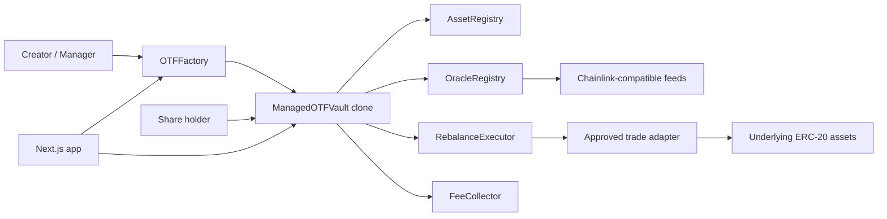

# Onchain Traded Funds

Repository/package folder: `onchaintradedfunds`.

Onchain Traded Funds, abbreviated OTF, is an experimental MVP for permissionless onchain investment vaults backed by approved stock-token style ERC-20 assets. Each vault is an ERC-20 share token and a custodian of its own underlying basket. Managers can rebalance, but only through a narrow, safety-checked execution path.

This code is not audited, not production ready, and must not be deployed to mainnet.

## Current Scope

This repository currently implements the first MVP slice:

- Foundry-style Solidity project structure.
- Vault, factory, registry, oracle, executor, fee collector, and mock contracts.
- Fixed minimum rebalance cooldown model.
- Direct basket vault creation through the factory.
- Proportional mint and redeem logic.
- Lazy share-based management fee accrual.
- Onchain thesis history.
- Oracle-valued NAV and weight checks.
- Approved-adapter rebalance execution.
- Foundry tests for cooldown boundary behavior.
- Next.js app with RainbowKit, wagmi, viem, and TanStack Query.
- A DeFi-style vault dashboard that reads directly from vault contracts.

## Repository Layout

```text
/
|-- contracts/
|   |-- src/
|   |   |-- interfaces/
|   |   |-- libraries/
|   |   |-- mocks/
|   |   |-- ManagedOTFVault.sol
|   |   |-- OTFFactory.sol
|   |   |-- RebalanceExecutor.sol
|   |   |-- AssetRegistry.sol
|   |   |-- OracleRegistry.sol
|   |   |-- FeeCollector.sol
|   |   `-- VaultTypes.sol
|   |-- test/
|   `-- foundry.toml
|-- app/
|   |-- src/app/
|   |-- src/components/
|   `-- src/lib/
|-- packages/generated/
|-- scripts/
|-- README.md
`-- SECURITY.md
```

## Architecture



### Contracts

`OTFFactory`

- Deploys deterministic minimal-proxy vault clones.
- Rejects invalid implementations.
- Stores vault list and creator mapping.
- Stores protocol treasury and protocol share of creator fees.
- Stores globally approved trade adapters.
- Rejects any vault cooldown below seven days.
- Does not custody vault assets.

`ManagedOTFVault`

- ERC-20 vault-share token.
- Custodian of tracked underlying assets.
- Proportional mint and redemption engine.
- Manager-controlled rebalance engine with immutable safety bounds.
- Onchain metadata and thesis history source.
- No arbitrary manager call surface.

`RebalanceExecutor`

- Verifies caller is a factory-created vault.
- Verifies adapter is globally approved.
- Executes typed adapter swaps only.
- Prevents arbitrary manager-supplied target calls from the vault.

`AssetRegistry`

- Onchain allowlist for approved assets in local development.
- Production integration point for an official Robinhood Chain stock-token registry.

`OracleRegistry`

- Maps approved assets to Chainlink-compatible price feeds.
- Lets vaults evaluate NAV, turnover, and post-trade weight deviation.

`FeeCollector`

- Receives the protocol portion of creator-selected management fee shares.

## Rebalance Cooldown

The rolling 30-day rebalance counter has been removed. There is no `maxRebalancesPer30Days`, timestamp circular buffer for monthly limits, `rebalancesInLast30Days()`, or `remainingRebalancesInWindow()`.

Each vault stores:

```solidity
uint256 public constant MIN_REBALANCE_COOLDOWN = 7 days;
uint64 public lastRebalanceTimestamp;
uint32 public rebalanceCooldown;
```

The factory and vault both reject cooldowns shorter than seven days:

```solidity
if (params.rebalanceCooldown < MIN_REBALANCE_COOLDOWN) {
    revert RebalanceCooldownTooShort();
}
```

`lastRebalanceTimestamp` is initialized to vault creation time. That means the first rebalance can happen only after:

```text
vault creation timestamp + rebalanceCooldown
```

Before every rebalance:

```solidity
uint256 nextAllowedTime = uint256(lastRebalanceTimestamp) + rebalanceCooldown;

if (block.timestamp < nextAllowedTime) {
    revert RebalanceCooldownActive(nextAllowedTime);
}
```

The timestamp is updated only after all rebalance work succeeds:

1. Fee accrual.
2. Cooldown check.
3. Target asset and target weight validation.
4. Oracle freshness checks.
5. NAV before calculation.
6. Turnover calculation.
7. Approved-adapter trade execution.
8. Temporary approval clearing.
9. Removed asset balance checks.
10. NAV after calculation.
11. Maximum NAV loss check.
12. Final target-weight deviation check.
13. Portfolio storage update.
14. Rebalance record write.
15. `lastRebalanceTimestamp` update.

Failed or reverted rebalances do not reset the cooldown because the whole transaction reverts.

The following operations do not count as portfolio rebalances and do not update `lastRebalanceTimestamp`:

- Thesis amendments.
- Fee accrual.
- Manager transfer start or acceptance.
- Fee-recipient transfer start or acceptance.
- Proportional minting.
- Proportional redemption.

The manager cannot shorten the cooldown after deployment. The MVP intentionally provides no setter for `rebalanceCooldown`.

## Vault Lifecycle

### Creation

The creator approves initial underlying assets to the factory. The factory:

1. Validates factory-level hard caps.
2. Computes a deterministic clone salt from creator, nonce, and initialization parameters.
3. Deploys the clone.
4. Transfers exact initial assets to the clone.
5. Calls `initialize`.
6. Records the vault and emits `VaultCreated`.

The vault initializer:

- Validates manager and fee recipient.
- Validates initial thesis byte length.
- Validates approved assets and no duplicates.
- Validates weight totals equal 10,000 bps.
- Validates min, max, and count constraints.
- Validates exact initial balances arrived.
- Sets creation-time cooldown baseline.
- Stores thesis version zero.
- Mints initial shares to the manager.

### Minting

Anyone can mint new vault shares by depositing the current proportional basket. The vault uses current raw balances and total supply:

```text
required amount of asset i =
shares requested * current vault balance of asset i / total share supply
```

The implementation rounds required inputs up. This protects existing holders from under-deposits caused by truncation.

Minting:

- Accrues fees first.
- Rejects zero shares.
- Rejects bad array lengths.
- Enforces caller-provided max inputs.
- Does not use oracles.
- Is blocked while a rebalance is executing.

### Redemption

Share holders redeem proportionally for the tracked underlying basket:

```text
asset output i =
shares burned * current vault balance of asset i / total share supply
```

The implementation rounds outputs down. This prevents redemption from transferring more than the redeemer's proportional claim.

Redemption:

- Accrues fees first.
- Supports allowance-based redemption.
- Enforces min outputs.
- Does not use oracles.
- Remains available when oracle-dependent actions fail.

## Rebalancing

Managers rebalance through one atomic function:

```solidity
function rebalance(
    address[] calldata targetAssets,
    uint16[] calldata targetWeightsBps,
    TradeInstruction[] calldata trades,
    string calldata rationale
) external;
```

The manager supplies the target portfolio, approved adapter trades, minimum outputs, and an onchain rationale. The vault does not expose arbitrary calls.

Each trade is typed:

```solidity
struct TradeInstruction {
    address adapter;
    address tokenIn;
    address tokenOut;
    uint256 amountIn;
    uint256 minAmountOut;
    bytes adapterData;
}
```

The vault grants exact temporary approvals to `RebalanceExecutor`, and clears them after each trade.

Retained rebalance protections:

- Approved assets only.
- Approved trading adapters only.
- Maximum portfolio turnover.
- Maximum NAV loss.
- Maximum deviation from target weights.
- Maximum number of assets.
- Maximum individual-asset weight.
- Minimum nonzero asset weight.
- Fresh onchain prices.
- Atomic execution.
- No arbitrary manager calls.
- Exact temporary approvals cleared after execution.

## NAV And Weight Math

Asset values are normalized to 18-decimal USD units:

```text
asset value =
raw token balance
* oracle price
/ 10 ** token decimals
* 1e18
/ 10 ** oracle decimals
```

The vault rejects:

- Missing oracle feeds.
- Nonpositive prices.
- Zero update timestamps.
- Future update timestamps.
- Incomplete rounds.
- Stale prices.
- Unsupported token or oracle decimals.

Current weights:

```text
asset value * 10,000 / NAV
```

NAV views can revert when oracle data is invalid. Redemption does not depend on NAV and should remain available.

## Turnover

Turnover measures how much of the portfolio is changing:

```text
turnover = 0.5 * sum(abs(currentWeight_i - targetWeight_i))
```

The implementation evaluates the union of current and target assets. Removed assets contribute their current weight. New assets contribute their target weight.

## Management Fees

The only annual vault fee is the creator-selected management fee. The protocol does not add a separate annual fee.

Fee accrual is lazy and share based. For elapsed time:

```text
r = annual fee rate * elapsed / 365 days
fee shares = supply * r / (1 - r)
```

New fee shares are split between:

- Fee recipient.
- Protocol fee collector.

The fee rate cannot be increased after deployment because there is no setter in the MVP.

## Onchain Thesis

The initial thesis is stored in contract storage as thesis version zero.

Managers can append amendments. They cannot edit or delete historical versions. A thesis amendment is descriptive only and does not weaken enforced safety parameters.

Each thesis version stores:

```solidity
struct ThesisVersion {
    uint64 timestamp;
    address author;
    bytes32 portfolioHash;
    string text;
}
```

Each thesis text is capped at 2,048 bytes.

## Frontend

The frontend is a Next.js App Router application using:

- TypeScript strict mode.
- RainbowKit.
- wagmi.
- viem.
- TanStack Query.
- Direct RPC contract reads.

The current dashboard shows:

- Vault name and symbol.
- Vault address state.
- Wallet connection state.
- Rebalance readiness.
- Rebalance cooldown.
- Last portfolio change.
- Next portfolio change available.
- Share supply.
- Creator fee.
- Protocol share of fee shares.
- Target asset allocation.
- Thesis text.
- Manager and fee recipient.
- Immutable safety limits.
- Manager action readiness.

The UI deliberately follows common DeFi product patterns:

- Wallet connection is in the top-right operational area.
- Readiness and risk state appear above actions.
- Portfolio and safety constraints are adjacent.
- Disabled manager actions explain eligibility through state.
- The page remains usable in demo mode without a deployed address.

References used for UI direction:

- Uniswap app and support docs: https://app.uniswap.org and https://support.uniswap.org
- Uniswap protocol docs: https://docs.uniswap.org
- Aave app and help docs: https://app.aave.com and https://aave.com/help
- Aave developer docs: https://aave.com/docs

The practical takeaway for this MVP is not to copy another protocol's visuals. It is to adopt the useful UX posture: wallet state is obvious, risk state is near actions, transaction constraints are visible before signing, and the screen is built for repeated operational use.

## Environment Variables

```text
NEXT_PUBLIC_WALLETCONNECT_PROJECT_ID=
NEXT_PUBLIC_RH_RPC_URL=
NEXT_PUBLIC_RH_TESTNET_RPC_URL=
NEXT_PUBLIC_FACTORY_ADDRESS=
NEXT_PUBLIC_EXAMPLE_VAULT_ADDRESS=
```

These are public frontend values. Do not put private keys in any `NEXT_PUBLIC_*` variable.

No production Robinhood Chain addresses are hardcoded. Any production address must be verified against official Robinhood Chain documentation before use.

## Local Development

Install dependencies:

```bash
corepack pnpm install
```

Compile Solidity with the local solc-js fallback:

```bash
corepack pnpm contracts:solc
```

Run app checks:

```bash
corepack pnpm lint
corepack pnpm typecheck
corepack pnpm build
```

Run the frontend:

```bash
cd app
corepack pnpm dev --hostname 127.0.0.1 --port 3000
```

Foundry commands, once Foundry is installed:

```bash
cd contracts
forge fmt --check
forge build
forge test -vvv
```

## Tests

The cooldown test suite covers:

- First rebalance before seven days reverts.
- First rebalance exactly seven days after creation succeeds.
- Second rebalance before another seven days reverts.
- Second rebalance exactly seven days later succeeds.
- A failed rebalance does not reset the cooldown.
- A thesis amendment does not reset the cooldown.
- Fee accrual does not reset the cooldown.
- The manager cannot shorten the cooldown.
- A vault may be created with a cooldown longer than seven days.
- The factory rejects a cooldown shorter than seven days.

Additional test coverage should be added before later milestones:

- Fuzz tests for asset amounts, share amounts, weights, fees, turnover, and decimals.
- Invariant tests for proportional claims, redemption bounds, target-weight totals, and manager non-custody.
- More rebalance failure-mode tests around stale prices, adapter slippage, approval clearing, and atomic rollback.

## Known Limitations

- No production Robinhood Chain addresses are verified or configured.
- No real DEX or RFQ adapter is integrated.
- No payment-token launch router is implemented yet.
- The UI manager actions are visual states only in this slice.
- The generated ABI package is currently a hand-maintained MVP subset.
- Foundry is expected for real Solidity testing, but is not installed in this local environment.
- The contracts are intentionally compact for MVP exploration and have not been gas optimized.

## Next Safest Milestone

The next safest milestone is to install Foundry, run the full Foundry test suite, add invariant tests, then implement direct-basket vault creation UI against a local Anvil deployment.
