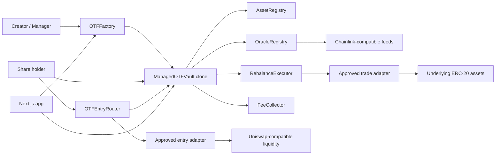

# Onchain Traded Funds

Repository/package folder: `onchaintradedfunds`.

Onchain Traded Funds, abbreviated OTF, is an experimental MVP for permissionless onchain investment vaults backed by approved stock-token style ERC-20 assets. Each vault is an ERC-20 share token and a custodian of its own underlying basket. Managers can rebalance, but only through a narrow, safety-checked execution path.

This code is not audited, not production ready, and must not be deployed to mainnet.

The normative contract invariants and deployment gates are defined in
[`docs/PROTOCOL_SECURITY_SPEC.md`](./docs/PROTOCOL_SECURITY_SPEC.md). The threat model and known
limitations are documented in [`SECURITY.md`](./SECURITY.md). A reproducible outside-review scope
is available in
[`docs/INDEPENDENT_SECURITY_REVIEW.md`](./docs/INDEPENDENT_SECURITY_REVIEW.md).

## Current Scope

This repository currently implements the first MVP slice:

- Foundry-style Solidity project structure.
- Vault, factory, registry, oracle, executor, fee collector, and mock contracts.
- Fixed minimum rebalance cooldown model.
- Direct basket vault creation through the factory.
- Proportional mint and redeem logic.
- Atomic fixed-USDG entry through a separately allowlisted router and adapter.
- Lazy share-based management fee accrual.
- Onchain strategy history binding rationales to target snapshots.
- Oracle-valued NAV and weight checks.
- Approved-adapter rebalance execution.
- Comprehensive Foundry unit, fuzz, and stateful invariant tests.
- Next.js app with RainbowKit, wagmi, viem, and TanStack Query.
- A DeFi-style vault dashboard that reads directly from vault contracts.

## Repository Layout

```text
/
|-- contracts/
|   |-- src/
|   |   |-- interfaces/
|   |   |-- libraries/
|   |   |-- mocks/
|   |   |-- ManagedOTFVault.sol
|   |   |-- OTFFactory.sol
|   |   |-- RebalanceExecutor.sol
|   |   |-- AssetRegistry.sol
|   |   |-- OracleRegistry.sol
|   |   |-- FeeCollector.sol
|   |   `-- VaultTypes.sol
|   |-- test/
|   `-- foundry.toml
|-- app/
|   |-- src/app/
|   |-- src/components/
|   `-- src/lib/
|-- packages/generated/
|-- scripts/
|-- README.md
`-- SECURITY.md
```

## Architecture



### Contracts

`OTFFactory`

- Deploys deterministic minimal-proxy vault clones.
- Rejects invalid implementations.
- Stores vault list and creator mapping.
- Reads the protocol treasury from the single authoritative `FeeCollector`.
- Stores globally approved trade adapters.
- Enforces the fixed 14-day strategy cooldown.
- Does not custody vault assets.

`ManagedOTFVault`

- ERC-20 vault-share token.
- ERC-1046 `tokenURI()` metadata with an embedded dark-theme OTF SVG image.
- Custodian of tracked underlying assets.
- Proportional mint and redemption engine.
- Manager-controlled rebalance engine with immutable safety bounds.
- Onchain strategy-rationale and target-history source.
- No arbitrary manager call surface.
- Delegates strategy-only calls to a fixed `ManagedOTFVaultStrategy` module.

`ManagedOTFVaultStrategy`

- Separates strategy and constrained trade logic from custody and share accounting.
- Is deployed alongside the shared calculator, bound immutably into each vault implementation, and
  cannot be replaced after deployment.
- Executes with the vault storage through `delegatecall`, preserving manager and executor identity.
- Cannot expose a generic call path or select arbitrary trade recipients.

`PortfolioCalculator`

- Statelessly normalizes oracle values and evaluates portfolio weights and challenge bands.
- Cannot transfer tokens, approve spenders, or mutate vault state.

`RebalanceExecutor`

- Verifies caller is a factory-created vault.
- Verifies adapter is globally approved.
- Executes typed adapter swaps only.
- Prevents arbitrary manager-supplied target calls from the vault.

`OTFEntryRouter`

- Allocates a fixed USDG input across constituent pools, mints the largest strictly proportional basket supported by the received assets, and enforces the user's minimum shares.
- Sells surplus constituents back to USDG under user-defined minimum refund rates and returns the proceeds to the payer.
- Lets a share holder atomically redeem the proportional basket, sell each constituent through approved adapters, and receive only USDG.
- Accepts only factory-created OTFs and never changes portfolio targets or custody rules.

`UniswapV3Adapter`

- Implements exact-input entry, redemption, and rebalance swaps against a configurable Uniswap V3-compatible router.
- Uses one immutable settlement token and fee tier, validates route endpoints, limits callers, returns output to the protocol caller, and clears temporary router approvals.
- Routes RWA-to-RWA rebalances through USDG as the only permitted intermediate token while the vault-visible input and output remain active constituents.

`AssetRegistry`

- Onchain allowlist for approved assets in local development.
- Production integration point for an official Robinhood Chain stock-token registry.
- A revoked constituent immediately receives a 0% effective target; remaining approved targets
  are renormalized proportionally to exactly 10,000 bps whenever at least one remains.
- If no approved positive-target constituent remains, the vault enters permissionless,
  irreversible terminal shutdown instead of opening a normal challenge.

`OracleRegistry`

- Maps approved assets to `AggregatorV3Interface` feeds, per-feed freshness thresholds, and an
  explicit validation mode.
- Lets vaults evaluate NAV, turnover, and post-trade weight deviation.

`FeeCollector`

- Receives the protocol portion of manager-selected fee shares.
- Allows only the configured treasury to claim those shares.
- Uses a two-step treasury transfer.

### Basket Share Safety

OTFs are multi-asset basket vaults, not ERC-4626 implementations. Users mint an explicit number of
shares by supplying every tracked asset proportionally. Required deposits round up and redemption
outputs round down.

Each OTF permanently locks `1_000_000` share wei inside itself at initialization. This prevents
total supply from reaching zero and keeps minting operational after every circulating share has
been redeemed. Initial share supply must be greater than the locked amount.

Factory seeding, basket minting, redemption, and rebalance execution verify exact token balance
deltas for both sender and receiver. Fee-on-transfer, sender-taxed, and unexpectedly rebasing
assets therefore revert atomically. Assets with nonstandard transfer accounting must not be
approved.

Direct donations of tracked assets become backing for every share. A donation can change NAV,
weights, and required mint amounts, but `maxAmountsIn` and `minAmountsOut` protect users from stale
previews. Prefunding a predicted vault address is treated as additional backing and cannot block
factory creation.

### Draft ERC-7621 Compatibility

The basket implements the function surface pinned from the
[official ERC-7621 draft assets](https://github.com/ethereum/ERCs/tree/2bc5bccf25aa06f98644c35fc92e6bf82947cfe2/assets/erc-7621),
ERC-165 detection, ERC-173 ownership, and the exact standard `Contributed`, `Withdrawn`, and
`Rebalanced` events.
`Rebalanced(newTokens, newWeights)` means that target composition changed. It does not imply that
trades ran or reserves reached the target.

OTF emits richer strategic, maintenance-trade, challenge, and fee-state events alongside the
standard events. Target proposal, trade execution, and completion are separate transitions.

The implementation is ERC-7621 interface-compatible with documented restrictions; it does not
claim full or unconditional compliance. It intentionally accepts only exact proportional basket
contributions, prevents ownership renunciation, and stages constituent removal until its reserve is
zero. During staged retirement, `getConstituents()` continues to return every asset in the live
redemption basket and reports a zero effective target for each retiring asset; this keeps previews,
withdrawals, and discovery in the same order until atomic liquidation and pruning. The draft rejects
zero constituent weights, so this retirement behavior and the proportional-only contribution model
remain documented extensions rather than a claim of unconditional conformance.

## Portfolio And Strategy Timing

The rolling 30-day rebalance counter has been removed. There is no `maxRebalancesPer30Days`, timestamp circular buffer for monthly limits, `rebalancesInLast30Days()`, or `remainingRebalancesInWindow()`.

Each vault stores:

```solidity
uint256 public constant STRATEGY_CHANGE_COOLDOWN = 14 days;
uint256 public constant STRATEGY_ACTIVATION_DELAY = 48 hours;
uint64 public lastCompletedStrategyTimestamp;
```

The completion timestamp is initialized at creation. A target proposal must satisfy the single
completion-based cooldown:

```text
lastCompletedStrategyTimestamp + STRATEGY_CHANGE_COOLDOWN
```

The proposal is also blocked while a challenge or strategy change is active, while another proposal
is pending, or whenever the portfolio is outside its completion bands.

The manager's valid proposal is stored as pending and leaves the current target untouched. It can
only be activated after the holder notice window:

```solidity
pendingStrategyActivationTime = block.timestamp + 48 hours;
```

`lastCompletedStrategyTimestamp` updates only when a strategic rebalance successfully completes
inside every final completion band. Pending proposals, cancelled proposals, failed trades, and
partial trades do not update the completion timestamp.

The following operations do not update `lastCompletedStrategyTimestamp`:

- Staging a rationale for a future ERC-7621 proposal.
- Fee accrual.
- Immediate manager transfer.
- Immediate fee-recipient update.
- Proportional minting.
- Proportional redemption.
- Partial maintenance trades.
- Challenge creation, synchronization, and resolution.

The cooldown is fixed at 14 days and has no manager setter.

## Vault Lifecycle

### Creation

The creator approves initial underlying assets to the factory. The factory:

1. Validates factory-level hard caps.
2. Computes a deterministic clone salt from creator, nonce, and initialization parameters.
3. Deploys the clone.
4. Transfers exact initial assets to the clone.
5. Calls `initialize`.
6. Records the vault and emits `VaultCreated`.

The vault initializer:

- Validates manager and fee recipient.
- Validates initial thesis byte length.
- Validates approved assets and no duplicates.
- Validates weight totals equal 10,000 bps.
- Validates min, max, and count constraints.
- Validates exact initial balances arrived.
- Sets creation-time cooldown baseline.
- Stores completed strategy version zero with its initial target snapshot.
- Mints initial shares to the manager.

### Minting

Anyone can mint new vault shares by depositing the current proportional basket. The vault uses current raw balances and total supply:

```text
required amount of asset i =
shares requested * current vault balance of asset i / total share supply
```

The implementation rounds required inputs up. This protects existing holders from under-deposits caused by truncation.

Minting:

- Accrues fees first.
- Rejects zero shares.
- Rejects bad array lengths.
- Enforces caller-provided max inputs.
- Does not use oracles.
- Is blocked while a rebalance is executing.
- Is blocked permanently after that OTF is sunset.
- Is blocked across every factory-created OTF while the factory owner has the reversible
  protocol deposit pause enabled.

### Entry paths

Investors have exactly three entry paths: provide the proportional RWA basket directly, buy
existing OTF shares from the official OTF/USDG pool, or provide a fixed USDG amount through
`OTFEntryRouter`. The router spends the entered
USDG across the constituent pools, derives the largest proportional basket from the assets actually
received, and reverts unless that basket mints at least the user's minimum shares. Only the strict
proportional amounts enter the OTF; surplus constituents are sold back through approved adapters
using protected minimum USDG rates and the resulting USDG is returned to the payer.

The cost shown by a Uniswap pool is not the OTF's accounting NAV. OTF NAV uses approved Chainlink
feeds, while entry cost depends on available AMM liquidity and price impact. The frontend displays
both values and the difference; users protect execution with per-leg minimum outputs, a minimum
share amount derived from their slippage setting, and a deadline. This route does not subsidize
entry from existing OTF assets.

The router and adapter are separate contracts so future RFQ, proprietary AMM, or order-book
liquidity can be integrated behind additional typed adapters without adding an arbitrary-call path
to the vault. See Robinhood's documented
[liquidity-source categories](https://docs.robinhood.com/chain/building-with-stock-tokens/#liquidity-sources).

### Exit paths

Share holders redeem proportionally for the tracked underlying basket:

```text
asset output i =
shares burned * current vault balance of asset i / total share supply
```

The implementation rounds outputs down. This prevents redemption from transferring more than the redeemer's proportional claim.

Redemption:

- Accrues fees first.
- Supports allowance-based redemption.
- Enforces min outputs.
- Does not use oracles.
- Remains available when oracle-dependent actions fail.

Investors likewise have exactly three exit paths: receive the proportional RWA basket directly,
sell OTF shares into the official OTF/USDG pool, or redeem through `OTFEntryRouter` for USDG. For
the routed settlement exit, the holder approves
the exact OTF share amount to `OTFEntryRouter`; the router burns those shares through the normal
proportional `redeem` path, sells each received constituent through an approved adapter, enforces
per-leg and aggregate minimum USDG outputs plus a deadline, and transfers the resulting USDG to the
chosen receiver. Pool proceeds may differ from the Chainlink-priced basket value, and the frontend
shows that difference before signing. A failed leg or insufficient aggregate output reverts the
share burn and every swap atomically.

## Strategic Rebalancing

The manager normally changes constituents and targets atomically with a rationale:

```solidity
function proposeStrategy(
    address[] calldata newTokens,
    uint256[] calldata newWeights,
    string calldata rationale
) external;
```

Draft ERC-7621 compatibility remains available by staging the rationale before its standard
two-argument function:

```solidity
function rebalance(
    address[] calldata newTokens,
    uint256[] calldata newWeights
) external;
```

Every path requires a non-empty rationale, rejects identical or reorder-only targets, records a
pending strategic target, and emits `TargetWeightsProposed`. The
active target and ERC-7621 constituent views remain unchanged for 48 hours so holders can redeem
against the current basket. A new target cannot be proposed while the old portfolio is outside
completion bands, during a challenge, while another proposal is pending, or while an earlier
strategic target remains unfinished.

After the notice period, `activatePendingStrategy()` revalidates assets, prices, fee and
challenge state, makes the target active, and emits the standard
`Rebalanced(newTokens, newWeights)` plus `TargetWeightsActivated`. Activation performs no trades.
Only the manager may activate or cancel the proposal. Manager transfer automatically cancels a
pending proposal.

The manager or an authorized executor performs one or more partial batches through:

```solidity
function executeRebalanceTrades(TradeInstruction[] calldata trades) external;
```

Each trade is typed:

```solidity
struct TradeInstruction {
    address adapter;
    address tokenIn;
    address tokenOut;
    uint256 amountIn;
    uint256 minAmountOut;
    bytes adapterData;
}
```

The vault grants exact temporary approvals to `RebalanceExecutor`, clears them after each trade,
and receives output directly. There is no generic target/calldata execution function.

For a final sale of a retiring asset, `amountIn = type(uint256).max` means "sell the vault's full
live balance." The vault resolves that balance inside the transaction and uses the resolved amount
for approval, execution, events, oracle-loss accounting, and same-transaction pruning. The sentinel
is rejected for active assets and for an empty retiring balance.

Every partial batch must use current constituents and approved adapters, satisfy explicit and
oracle-valued slippage, stay within the NAV-loss bound, avoid worsening any constituent,
and strictly reduce total distance from the active target.

When a successful strategic trade batch brings every constituent inside the narrower completion
bands, the vault completes the strategic rebalance atomically, emits
`StrategicRebalanceCompleted`, and updates `lastCompletedStrategyTimestamp`. An active strategy does
not itself lock manager fees; only a challenge escrows them, and sunset stops future accrual.
Anyone may still call `completeStrategicRebalance()` when no trade is needed or
natural price movement reaches the bands.

Retained rebalance protections:

- Approved output assets; retiring inputs may only be sold down.
- Approved trading adapters only.
- Onchain strategy-turnover disclosure.
- Linearly replenishing NAV-loss budget; a full charge recovers over seven days and gains do not
  restore consumed capacity.
- Narrow completion bands and wider challenge bands.
- Protocol-wide minimum target weight with a permanent 1% floor; the factory owner may raise it or
  reduce it back to, but never below, that floor.
- At most 100 tracked assets, including zero-target assets awaiting retirement.
- Fresh onchain prices.
- Atomicity of each partial trade transaction.
- No arbitrary manager calls.
- Exact temporary approvals cleared after execution.

### Strategy And Execution Authority

The manager alone controls constituents, targets, bands, fee rate, ownership, and the executor
allowlist. A manager is automatically added to that allowlist and may authorize multiple additional
executor addresses. The manager may also remove or restore their own trade-execution permission.

Executors can only call the constrained trade-batch function. They cannot change strategy,
permissions, fees, ownership, or adapters and cannot direct assets to arbitrary recipients.
All executor authorizations are cleared on manager transfer, then the new manager is added as the
sole authorized executor. Executors receive no bounty or
reimbursement from vault assets.

### OTF Sunset And Emergency Deposit Pause

The manager may permanently sunset an operational OTF only after its strategy cooldown has ended
and when no challenge, pending proposal, or strategic rebalance is active. Sunset checkpoints the final valid fee interval and then
permanently disables new deposits, future fee accrual, challenges, target changes, and constrained
trades. Standard share transfers and proportional redemptions remain available so holders can wind
down without depending on the manager, oracle freshness, or a separate protocol action.

If registry revocations leave no approved positive-target constituent, anyone may call
`finalizeTerminalShutdown()`. `flagOutOfBand()` detects the same condition and terminalizes
instead of opening a normal challenge. This bypasses the manager cooldown, closes any existing
challenge according to its deadline economics, and is irreversible even if an asset is later
reapproved. Redemptions and bounded retiring-dust pruning remain available.

Separately, the factory owner may call `setDepositsPaused(bool)` to reversibly pause new OTF
creation and deposits across all OTFs
created by the factory. This emergency control is enforced inside each vault, including deposits
routed through `OTFEntryRouter`; it does not pause redemptions, transfers, or ordinary
secondary-market trading.

### Weight Bands And Challenges

Each target has a wider challenge band and a narrower completion band. Anyone may call
`flagOutOfBand()`, but fresh approved prices must prove a real challenge-band breach.

A valid challenge locks target changes and manager-fee withdrawals while the fixed seven-day grace
period runs. This spans scheduled market weekends and typical holiday closures without making the
response window a manager-selected policy. All valid fees earned before the challenge start are crystallized first and cannot be
forfeited later. Natural price movement and constrained trades can both restore the basket. If the
manager stops the challenge before the deadline, accrued fees are withdrawn normally. If the
deadline is missed, manager fees from the challenge window are forfeited: 50% becomes a claimable
reward for the challenge caller and the remaining 50% is never minted. Deposits and proportional
withdrawals remain enabled.

## NAV And Weight Math

Asset values are normalized to 18-decimal USD units:

```text
asset value =
raw token balance
* oracle price
/ 10 ** token decimals
* 1e18
/ 10 ** oracle decimals
```

The vault rejects:

- Missing oracle feeds.
- Nonpositive prices.
- Zero update timestamps.
- Future update timestamps.
- Incomplete rounds.
- Stale prices.
- An enabled `oraclePaused()` flag or an unavailable required pause check.
- Unsupported token or oracle decimals.

`OracleRegistry` stores a feed, maximum staleness, and validation mode for each asset. Robinhood
equity feeds publish 24/5; their configurations use 25 hours for the 24-hour heartbeat plus a one-hour
delivery buffer and use `RobinhoodStockToken` mode, which requires the asset's `oraclePaused()` check. The freshness deadline is measured
from each feed's latest update, so oracle-priced actions may continue into a weekend before pausing until
fresh prices arrive. Future feeds can use different policies without manager-controlled oracle settings.

Current weights:

```text
asset value * 10,000 / NAV
```

NAV views can revert when oracle data is invalid. Redemption does not depend on NAV and should remain available.

## Turnover

Turnover measures how much of the portfolio is changing:

```text
turnover = 0.5 * sum(abs(currentWeight_i - targetWeight_i))
```

The implementation evaluates the union of current and target assets. Removed assets contribute their current weight. New assets contribute their target weight.
Turnover is recorded with each completed strategy for disclosure and history; it does not limit target proposals or trade batches.

## Management Fees

The only annual vault fee is the manager-selected fee, bounded by the protocol maximum. The
protocol does not add a separate annual fee.

Fee accrual is lazy and share based. For elapsed time:

```text
growth = (1 / (1 - annual fee rate)) ^ (elapsed / 365 days)
fee shares = supply * (growth - 1)
```

The growth rule is composable: processing one interval at once or dividing it across deposits,
redemptions, and explicit accrual calls produces the same economic fee, subject only to fixed-point
and indivisible share-wei rounding. Fractional share-wei and protocol-split remainders are retained
for later checkpoints rather than discarded. A configured 10% rate therefore produces exactly 10%
holder dilution after one full 365-day year with no intervening supply change.

Every contribution, basket mint, withdrawal, and redemption checkpoints fees before changing share
supply. A fee-rate update first closes the old-rate interval at the transaction timestamp, including
when it has accrued less than one share-wei, and only future time uses the new rate.

New fee shares are split between:

- Manager fee recipient.
- Protocol fee collector.

Manager shares follow the fee state:

- `Accruing`: manager shares are delivered normally.
- `Escrowed`: a strategy challenge is active and manager-fee withdrawals are locked.
- `Suspended`: the challenge deadline has passed and challenge-window fees are forfeitable.
- `Sunset`: the final fee interval has been checkpointed and no future fees accrue.

Timely restoration lets the manager stop the challenge and withdraw accrued fees. Missing the
deadline credits 50% of the lost challenge-window fees to the caller and skips minting the rest.
Fee-rate changes are allowed only while strategy is unlocked and the portfolio is inside completion
bands, and never apply retroactively.

## Onchain Strategy History

The initial thesis and target snapshot are stored as completed strategy version zero at deployment.
That completion timestamp starts the first fixed 14-day cooldown.

Every later strategy requires a target change and locked rationale. Cancelled proposals never enter
canonical history. Activation creates the permanent version, and successful rebalance completion
updates that same record. Managers cannot append, edit, or delete rationales independently.

Each strategy version stores:

```solidity
struct StrategyVersion {
    uint64 proposedAt;
    uint64 activatedAt;
    uint64 completedAt;
    address author;
    string rationale;
}
```

Each rationale is capped at 2,048 bytes and is stored with the version's complete target snapshot.
The snapshot is canonical; redundant portfolio hashes are not stored.

## Frontend

The frontend is a Next.js App Router application using:

- TypeScript strict mode.
- RainbowKit.
- wagmi.
- viem.
- TanStack Query.
- Direct RPC contract reads.

The current dashboard shows:

- Vault name and symbol.
- Vault address state.
- Wallet connection state.
- Target-proposal readiness and cooldown.
- Last and next strategic target proposal times.
- Completion-band, strategic-rebalance, and challenge status.
- Fee state, forfeited manager fees, and claimable challenge rewards.
- Authorized executor count.
- Share supply.
- Manager fee.
- Protocol share of fee shares.
- Target asset allocation.
- Strategy history with target changes, rationale, and lifecycle state.
- Manager and fee recipient.
- Immutable safety limits.
- Manager action readiness.

The UI deliberately follows common DeFi product patterns:

- Wallet connection is in the top-right operational area.
- Readiness and risk state appear above actions.
- Portfolio and safety constraints are adjacent.
- Disabled manager actions explain eligibility through state.
- The page remains usable in demo mode without a deployed address.

References used for UI direction:

- Uniswap app and support docs: https://app.uniswap.org and https://support.uniswap.org
- Uniswap protocol docs: https://docs.uniswap.org
- Aave app and help docs: https://app.aave.com and https://aave.com/help
- Aave developer docs: https://aave.com/docs

The practical takeaway for this MVP is not to copy another protocol's visuals. It is to adopt the useful UX posture: wallet state is obvious, risk state is near actions, transaction constraints are visible before signing, and the screen is built for repeated operational use.

## Environment Variables

```text
NEXT_PUBLIC_WALLETCONNECT_PROJECT_ID=
NEXT_PUBLIC_RH_RPC_URL=
NEXT_PUBLIC_RH_TESTNET_RPC_URL=
```

These optional values configure wallet connectivity and RPC endpoints. Contract and token addresses
are not environment variables. The frontend and deployment utilities share the checked-in
`app/src/config/robinhood-testnet.json` file. The frontend reads `allVaults()` from the factory
recorded there; individual OTF addresses are discovered from the factory.

Robinhood testnet deployment requires only the private signer as secret configuration:

```text
DEPLOYER_PRIVATE_KEY=
```

Keep that value in the ignored `.env.deploy.local` file. Never add it to the address JSON. The
deployment script reads its chain, treasury, approved assets, price feeds, and external protocol
addresses from `app/src/config/robinhood-testnet.json`. It rejects an empty protocol catalog unless
`ALLOW_EMPTY_PROTOCOL_CONFIG=true` is set explicitly.

Deploying always recompiles source-only artifacts before broadcasting, targets the Shanghai EVM
supported by Robinhood Chain Testnet, and updates the shared address configuration only after the
entire suite and registry setup succeed:

```bash
corepack pnpm contracts:deploy:robinhood-testnet
```

`USDG_ADDRESS` and all four Uniswap V3-compatible addresses are required because every new OTF
receives an official OTF/USDG pool during its factory transaction. Robinhood testnet currently
points these fields at Synthra; Robinhood mainnet can use official Uniswap without changing vault
interfaces.

After the base protocol and mock oracle catalog are configured, deploy the V3 adapter and entry
router and create the five RWA/USDG pools with:

```bash
corepack pnpm contracts:configure:robinhood-testnet-synthra
```

The command is idempotent. It verifies the configured contracts, approvals, assets, fee tier, and
fresh oracle rounds; deploys or reuses the adapter and entry router; creates or adopts each 0.3%
RWA/USDG pool; and records the verified addresses and transaction evidence in the shared JSON. It
does not add liquidity. Entry, USDG redemption, and manager rebalance routes remain disabled until
someone funds every required constituent pool through Synthra.

The script deploys `OTFV3MarketRegistry`, permanently configures it on the factory before the first
OTF can be created, and writes the registry, swap-router, and quoter addresses into the shared JSON.
OTF creation creates or adopts the canonical Uniswap V3 OTF/USDG pool at the fixed 0.05% fee tier,
initializes a new pool from NAV per share, and records it as the immutable official pool. No
liquidity is taken from the OTF. Any wallet may add liquidity separately and owns each resulting
Uniswap position it creates; the pool association cannot be removed or replaced.

Robinhood Chain Testnet does not currently publish official Chainlink equity-feed proxies. For
development, deploy the protocol with `ALLOW_EMPTY_PROTOCOL_CONFIG=true`, compile the current
artifacts, then configure the five UI catalog assets with self-updating synthetic USD feeds:

```bash
corepack pnpm contracts:solc
corepack pnpm contracts:configure:robinhood-testnet-mocks
```

Each feed derives a deterministic synthetic path from chain time: a `$1.00` baseline, `+5` bps of
daily drift, and bounded `+/-50` bps pseudo-random movement that changes every five minutes. Every
read reports the current block timestamp as `updatedAt`, so testnet OTF operations do not depend on
an owner, keeper, cron job, or manual refresh transaction. The answer remains stable within a
timestamp, and the owner-only `setAnswer` function is retained solely as an optional baseline
reset.

The configurator records every deployment and registry transaction in
`app/src/config/robinhood-testnet.json`. It automatically replaces legacy version-1 manually updated
feeds and retains version-2 self-updating feeds on later runs. The synthetic path is intentionally
predictable from public chain data; these feeds are UI and integration fixtures, not Chainlink,
market data, or suitable adversarial-test price sources.

Robinhood Chain Mainnet uses the official Chainlink proxy directory instead. Its tokenized-equity
answers already include the Stock Token `uiMultiplier()` for dividends, splits, and other
corporate actions; consumers must not multiply by `uiMultiplier()` again. See the
[Chainlink Robinhood tokenized-equity documentation](https://docs.chain.link/data-feeds/tokenized-equity-feeds/robinhood).

No production Robinhood Chain addresses are hardcoded. Any production address must be verified against official Robinhood Chain documentation before use.

## Local Development

Install dependencies:

```bash
corepack pnpm install
```

Compile Solidity with the local solc-js fallback:

```bash
corepack pnpm contracts:solc
```

Run app checks:

```bash
corepack pnpm lint
corepack pnpm typecheck
corepack pnpm build
```

Run the frontend:

```bash
cd app
corepack pnpm dev --hostname 127.0.0.1 --port 3000
```

Foundry commands:

```bash
corepack pnpm contracts:security
cd contracts
forge fmt --check
forge build
forge test
forge test --match-contract ProtocolFuzzTest -vv
forge test --match-contract ProtocolInvariantTest -vv
forge coverage --report summary
```

`contracts:security` forces a clean production build and enforces warning-free Foundry and Solhint
security lint, canonical vault/module storage, deployable bytecode sizes, and restricted
delegation surfaces.

## Tests

The Solidity suite contains broad deterministic, fuzz-property, and stateful invariant coverage.
Default settings in `contracts/foundry.toml` run every fuzz property 1,000 times and each invariant
through 128 sequences of 64 generated actions.

Deterministic coverage includes:

- First target proposal before 14 days reverts.
- First target proposal exactly 14 days after creation succeeds.
- A later proposal before 14 days from rebalance completion reverts.
- A later proposal exactly 14 days from rebalance completion succeeds.
- A failed rebalance does not reset the cooldown.
- Staging a future strategy rationale does not reset the cooldown or create history.
- Fee accrual does not reset the cooldown.
- The manager cannot shorten the cooldown.
- The factory rejects every cooldown other than 14 days.
- Active challenges and out-of-band portfolios block proposals.
- Manager-only sunset is permanent, requires a completed cooldown and a challenge-free strategy state, stops future
  fees, deposits, challenges, and strategy actions, and preserves proportional redemptions.
- The factory-owner deposit pause blocks OTF creation and deposits across multiple
  OTFs, is reversible, and does not block redemptions.
- Factory clone prediction, enumeration, ownership, treasury transfers, global bounds, and
  atomic creation rollback.
- Proportional basket minting and redemption, delegated redemption, fee dilution, fee splits,
  role transfers, and strategy history.
- Oracle price validity, timestamps, round completeness, staleness, and missing feeds.
- Asset, weight, count, turnover, NAV-loss, target-deviation, adapter, trade, approval-clearing,
  and atomic rollback protections.
- Draft ERC-7621 views, previews, actions, interface detection, ownership, and exact events.
- Challenge breaches, natural and traded recovery, deadline forfeiture, caller rewards,
  fee resumption, and deposits and withdrawals during challenge states.
- Authorized executor success, strategy isolation, unsupported-token and adapter rejection,
  trade-size enforcement, recipient confinement, and executor clearing on manager transfer.
- Atomic fixed-USDG entry, exact-input minimum-share protection, proportional-only deposits,
  slippage-protected USDG surplus refunds, entry-adapter authorization, expired entry rejection,
  and Uniswap-compatible direct and USDG-hop adapter behavior.
- Atomic USDG redemption, exact share approval, per-leg and aggregate minimum outputs, deadline
  enforcement, and complete rollback when an exit adapter or quote is invalid.
- Canonical vault/module storage, immutable module identity, runtime code-hash integrity,
  direct-module-call rejection, and callback isolation.

Fuzz properties cover arbitrary valid and invalid cooldowns, target weights, basket share
amounts, fee rates and elapsed time, oracle prices, share transfers, and manager addresses.

The stateful handler mixes basket mints, redemptions, share transfers, fee accrual, staged
rationales, valid rebalances, and intentionally invalid rebalances. Invariants continuously
assert share-supply accounting, valid mandate weights, positive backing and NAV, cleared
executor approvals and balances, cooldown/history consistency, append-only administrative
history, and immutable factory provenance.

## Known Limitations

- No production Robinhood Chain addresses are verified or configured.
- RWA/USDG pools are initialized separately from liquidity provisioning; constituent entry, USDG redemption, and rebalances remain unavailable while any required pool has zero active liquidity.
- RFQ, proprietary AMM, and order-book adapters are not implemented.
- USDG entry currently quotes direct USDG-to-constituent pools; more advanced route discovery is not implemented.
- The generated ABI package is currently a hand-maintained MVP subset.
- The contracts are intentionally compact for MVP exploration and have not been gas optimized.
- ERC-7621 remains a draft and its interface may change.

## Next Safest Milestone

The next safest milestone is an independent smart-contract audit, followed by a testnet
deployment rehearsal with verified Robinhood Chain addresses, live oracle feeds, and an
approved adapter integration.
