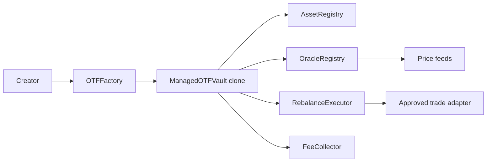

# Onchain Traded Funds

Repository/package folder: `onchaintradedfunds`.

Experimental MVP for permissionless onchain fund vaults. This repository currently focuses on the corrected rebalance cooldown model and the supporting vault/factory path needed to test it.

## Contract Architecture



## Rebalance Cooldown

Each vault stores:

```solidity
uint256 public constant MIN_REBALANCE_COOLDOWN = 7 days;
uint64 public lastRebalanceTimestamp;
uint32 public rebalanceCooldown;
```

`lastRebalanceTimestamp` is initialized to vault creation time, so the first rebalance is blocked until `creation + rebalanceCooldown`. The factory and vault both reject any cooldown shorter than seven days. There is no manager function that can reduce or alter the cooldown after deployment.

Before every rebalance, the vault calculates:

```solidity
uint256 nextAllowedTime = uint256(lastRebalanceTimestamp) + rebalanceCooldown;
```

If the current block timestamp is earlier, the rebalance reverts with `RebalanceCooldownActive(nextAllowedTime)`. The timestamp is updated only after trades execute and final NAV, turnover, removed-asset, and target-weight checks pass.

Thesis amendments, fee accrual, manager transfers, and fee-recipient transfers do not update `lastRebalanceTimestamp`.

## Retained Rebalance Protections

The current vault implementation keeps the MVP safety checks around approved assets, approved adapters, exact temporary approvals, atomic execution, turnover, NAV loss, target-weight deviation, maximum asset count, individual and minimum weights, and fresh onchain prices.

## Frontend

The Next.js app includes a dashboard readout for:

```text
Rebalance cooldown: 7 days
Last portfolio change: [timestamp]
Next portfolio change available: [timestamp]
```

Set `NEXT_PUBLIC_EXAMPLE_VAULT_ADDRESS` to a deployed vault address. RPC configuration is read from:

```text
NEXT_PUBLIC_RH_RPC_URL
NEXT_PUBLIC_RH_TESTNET_RPC_URL
NEXT_PUBLIC_WALLETCONNECT_PROJECT_ID
```

No Robinhood Chain production addresses are hardcoded.

## Local Commands

Foundry commands, once Foundry is installed:

```bash
cd contracts
forge fmt --check
forge build
forge test -vvv
```

Node-side checks:

```bash
corepack pnpm install
corepack pnpm contracts:solc
corepack pnpm --filter @onchaintradedfunds/app lint
corepack pnpm --filter @onchaintradedfunds/app typecheck
corepack pnpm --filter @onchaintradedfunds/app build
```

## Status

This is unaudited experimental financial software. Do not deploy it to mainnet.
