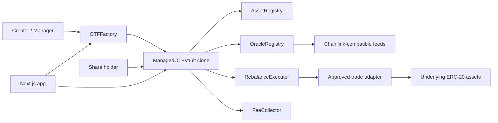

# Onchain Traded Funds

Repository/package folder: `onchaintradedfunds`.

Onchain Traded Funds, abbreviated OTF, is an experimental MVP for permissionless onchain investment vaults backed by approved stock-token style ERC-20 assets. Each vault is an ERC-20 share token and a custodian of its own underlying basket. Managers can rebalance, but only through a narrow, safety-checked execution path.

This code is not audited, not production ready, and must not be deployed to mainnet.

The normative contract invariants and deployment gates are defined in
[`docs/PROTOCOL_SECURITY_SPEC.md`](./docs/PROTOCOL_SECURITY_SPEC.md). The threat model and known
limitations are documented in [`SECURITY.md`](./SECURITY.md).

## Current Scope

This repository currently implements the first MVP slice:

- Foundry-style Solidity project structure.
- Vault, factory, registry, oracle, executor, fee collector, and mock contracts.
- Fixed minimum rebalance cooldown model.
- Direct basket vault creation through the factory.
- Proportional mint and redeem logic.
- Lazy share-based management fee accrual.
- Onchain thesis history.
- Oracle-valued NAV and weight checks.
- Approved-adapter rebalance execution.
- Comprehensive Foundry unit, fuzz, and stateful invariant tests.
- Next.js app with RainbowKit, wagmi, viem, and TanStack Query.
- A DeFi-style vault dashboard that reads directly from vault contracts.

## Repository Layout

```text
/
|-- contracts/
|   |-- src/
|   |   |-- interfaces/
|   |   |-- libraries/
|   |   |-- mocks/
|   |   |-- ManagedOTFVault.sol
|   |   |-- OTFFactory.sol
|   |   |-- RebalanceExecutor.sol
|   |   |-- AssetRegistry.sol
|   |   |-- OracleRegistry.sol
|   |   |-- FeeCollector.sol
|   |   `-- VaultTypes.sol
|   |-- test/
|   `-- foundry.toml
|-- app/
|   |-- src/app/
|   |-- src/components/
|   `-- src/lib/
|-- packages/generated/
|-- scripts/
|-- README.md
`-- SECURITY.md
```

## Architecture



### Contracts

`OTFFactory`

- Deploys deterministic minimal-proxy vault clones.
- Rejects invalid implementations.
- Stores vault list and creator mapping.
- Stores protocol treasury and protocol share of manager fees.
- Stores globally approved trade adapters.
- Rejects any vault cooldown below seven days.
- Does not custody vault assets.

`ManagedOTFVault`

- ERC-20 vault-share token.
- Custodian of tracked underlying assets.
- Proportional mint and redemption engine.
- Manager-controlled rebalance engine with immutable safety bounds.
- Onchain metadata and thesis history source.
- No arbitrary manager call surface.
- Delegates strategy-only calls to a fixed `ManagedOTFVaultStrategy` module.

`ManagedOTFVaultStrategy`

- Separates strategy and constrained trade logic from custody and share accounting.
- Is created with each vault implementation and cannot be replaced after deployment.
- Executes with the vault storage through `delegatecall`, preserving manager and executor identity.
- Cannot expose a generic call path or select arbitrary trade recipients.

`PortfolioCalculator`

- Statelessly normalizes oracle values and evaluates portfolio weights and challenge bands.
- Cannot transfer tokens, approve spenders, or mutate vault state.

`RebalanceExecutor`

- Verifies caller is a factory-created vault.
- Verifies adapter is globally approved.
- Executes typed adapter swaps only.
- Prevents arbitrary manager-supplied target calls from the vault.

`AssetRegistry`

- Onchain allowlist for approved assets in local development.
- Production integration point for an official Robinhood Chain stock-token registry.

`OracleRegistry`

- Maps approved assets to Chainlink-compatible price feeds.
- Lets vaults evaluate NAV, turnover, and post-trade weight deviation.

`FeeCollector`

- Receives the protocol portion of manager-selected fee shares.
- Allows only the configured treasury to claim those shares.
- Uses a two-step treasury transfer.

### Basket Share Safety

OTFs are multi-asset basket vaults, not ERC-4626 implementations. Users mint an explicit number of
shares by supplying every tracked asset proportionally. Required deposits round up and redemption
outputs round down.

Each OTF permanently locks `1_000_000` share wei inside itself at initialization. This prevents
total supply from reaching zero and keeps minting operational after every circulating share has
been redeemed. Initial share supply must be greater than the locked amount.

Factory seeding, basket minting, redemption, and rebalance execution verify exact token balance
deltas for both sender and receiver. Fee-on-transfer, sender-taxed, and unexpectedly rebasing
assets therefore revert atomically. Assets with nonstandard transfer accounting must not be
approved.

Direct donations of tracked assets become backing for every share. A donation can change NAV,
weights, and required mint amounts, but `maxAmountsIn` and `minAmountsOut` protect users from stale
previews. Prefunding a predicted vault address is treated as additional backing and cannot block
factory creation.

### Draft ERC-7621 Surface

The basket implements the current draft ERC-7621 function surface, ERC-165 detection, ERC-173
ownership, and the exact standard `Contributed`, `Withdrawn`, and `Rebalanced` events.
`Rebalanced(newTokens, newWeights)` means that target composition changed. It does not imply that
trades ran or reserves reached the target.

OTF emits richer strategic, maintenance-trade, challenge, and fee-state events alongside the
standard events. Target proposal, trade execution, and completion are separate transitions.

The implementation does not claim unconditional ERC-7621 compliance. It intentionally accepts
only proportional basket contributions and rejects ownership renunciation. Constituent removal is
staged: a constituent must have zero reserve before leaving the standardized list.

## Strategy-Change Cooldown

The rolling 30-day rebalance counter has been removed. There is no `maxRebalancesPer30Days`, timestamp circular buffer for monthly limits, `rebalancesInLast30Days()`, or `remainingRebalancesInWindow()`.

Each vault stores:

```solidity
uint256 public constant MIN_REBALANCE_COOLDOWN = 7 days;
uint64 public lastRebalanceTimestamp;
uint32 public rebalanceCooldown;
```

The factory and vault both reject cooldowns shorter than seven days:

```solidity
if (params.rebalanceCooldown < MIN_REBALANCE_COOLDOWN) {
    revert RebalanceCooldownTooShort();
}
```

`lastRebalanceTimestamp` is initialized to vault creation time. The first strategic target
proposal can happen only after:

```text
vault creation timestamp + rebalanceCooldown
```

Before every target proposal:

```solidity
uint256 nextAllowedTime = uint256(lastRebalanceTimestamp) + rebalanceCooldown;

if (block.timestamp < nextAllowedTime) {
    revert RebalanceCooldownActive(nextAllowedTime);
}
```

The timestamp updates when a valid strategic target is locked. Failed proposals do not reset it.
Partial maintenance trades and completion do not reset it.

The following operations do not count as portfolio rebalances and do not update `lastRebalanceTimestamp`:

- Thesis amendments.
- Fee accrual.
- Manager transfer start or acceptance.
- Fee-recipient transfer start or acceptance.
- Proportional minting.
- Proportional redemption.
- Partial maintenance trades.
- Challenge creation, synchronization, and resolution.
- Strategic completion.

The manager cannot shorten the cooldown after deployment. The MVP intentionally provides no setter for `rebalanceCooldown`.

## Vault Lifecycle

### Creation

The creator approves initial underlying assets to the factory. The factory:

1. Validates factory-level hard caps.
2. Computes a deterministic clone salt from creator, nonce, and initialization parameters.
3. Deploys the clone.
4. Transfers exact initial assets to the clone.
5. Calls `initialize`.
6. Records the vault and emits `VaultCreated`.

The vault initializer:

- Validates manager and fee recipient.
- Validates initial thesis byte length.
- Validates approved assets and no duplicates.
- Validates weight totals equal 10,000 bps.
- Validates min, max, and count constraints.
- Validates exact initial balances arrived.
- Sets creation-time cooldown baseline.
- Stores thesis version zero.
- Mints initial shares to the manager.

### Minting

Anyone can mint new vault shares by depositing the current proportional basket. The vault uses current raw balances and total supply:

```text
required amount of asset i =
shares requested * current vault balance of asset i / total share supply
```

The implementation rounds required inputs up. This protects existing holders from under-deposits caused by truncation.

Minting:

- Accrues fees first.
- Rejects zero shares.
- Rejects bad array lengths.
- Enforces caller-provided max inputs.
- Does not use oracles.
- Is blocked while a rebalance is executing.

### Redemption

Share holders redeem proportionally for the tracked underlying basket:

```text
asset output i =
shares burned * current vault balance of asset i / total share supply
```

The implementation rounds outputs down. This prevents redemption from transferring more than the redeemer's proportional claim.

Redemption:

- Accrues fees first.
- Supports allowance-based redemption.
- Enforces min outputs.
- Does not use oracles.
- Remains available when oracle-dependent actions fail.

## Strategic Rebalancing

Only the manager changes constituents and targets through the draft ERC-7621 function:

```solidity
function rebalance(
    address[] calldata newTokens,
    uint256[] calldata newWeights
) external;
```

This call only updates and locks the strategic target. It emits the standard
`Rebalanced(newTokens, newWeights)` plus `TargetWeightsProposed`. A new target cannot be proposed
while the old portfolio is outside completion bands, during a challenge, or while an earlier
strategic target remains unfinished.

The manager or an authorized executor performs one or more partial batches through:

```solidity
function executeRebalanceTrades(TradeInstruction[] calldata trades) external;
```

Each trade is typed:

```solidity
struct TradeInstruction {
    address adapter;
    address tokenIn;
    address tokenOut;
    uint256 amountIn;
    uint256 minAmountOut;
    bytes adapterData;
}
```

The vault grants exact temporary approvals to `RebalanceExecutor`, clears them after each trade,
and receives output directly. There is no generic target/calldata execution function.

Every partial batch must use current constituents and approved adapters, satisfy explicit and
oracle-valued slippage, stay within turnover and NAV-loss bounds, avoid worsening any constituent,
and strictly reduce total distance from the active target.

Anyone may call `completeStrategicRebalance()` after all constituents enter the narrower completion
bands. Only then is `StrategicRebalanceCompleted` emitted and escrowed manager fees released.

Retained rebalance protections:

- Approved assets only.
- Approved trading adapters only.
- Maximum portfolio turnover.
- Maximum NAV loss.
- Narrow completion bands and wider challenge bands.
- Maximum number of assets.
- Maximum individual-asset weight.
- Minimum nonzero asset weight.
- Fresh onchain prices.
- Atomicity of each partial trade transaction.
- No arbitrary manager calls.
- Exact temporary approvals cleared after execution.

### Strategy And Execution Authority

The manager alone controls constituents, targets, bands, fee rate, ownership, and the executor
allowlist. The manager can trade directly and may authorize multiple executor addresses.

Executors can only call the constrained trade-batch function. They cannot change strategy,
permissions, fees, ownership, or adapters and cannot direct assets to arbitrary recipients.
All executor authorizations are cleared on manager transfer. Executors receive no bounty or
reimbursement from vault assets.

### Weight Bands And Challenges

Each target has a wider challenge band and a narrower completion band. Anyone may call
`flagOutOfBand()`, but fresh approved prices must prove a real challenge-band breach.

A valid challenge locks target changes, starts the configured grace period, and escrows newly
accrued manager fees. Natural price movement and constrained trades can both restore the basket.
If the deadline is missed, escrowed manager fees are burned and future manager-fee accrual is
suspended. Deposits and proportional withdrawals remain enabled. Restoration resumes only future
fees; forfeited and suspended-period fees are never recovered.

## NAV And Weight Math

Asset values are normalized to 18-decimal USD units:

```text
asset value =
raw token balance
* oracle price
/ 10 ** token decimals
* 1e18
/ 10 ** oracle decimals
```

The vault rejects:

- Missing oracle feeds.
- Nonpositive prices.
- Zero update timestamps.
- Future update timestamps.
- Incomplete rounds.
- Stale prices.
- Unsupported token or oracle decimals.

Current weights:

```text
asset value * 10,000 / NAV
```

NAV views can revert when oracle data is invalid. Redemption does not depend on NAV and should remain available.

## Turnover

Turnover measures how much of the portfolio is changing:

```text
turnover = 0.5 * sum(abs(currentWeight_i - targetWeight_i))
```

The implementation evaluates the union of current and target assets. Removed assets contribute their current weight. New assets contribute their target weight.

## Management Fees

The only annual vault fee is the manager-selected fee, bounded by the protocol maximum. The
protocol does not add a separate annual fee.

Fee accrual is lazy and share based. For elapsed time:

```text
r = annual fee rate * elapsed / 365 days
fee shares = supply * r / (1 - r)
```

New fee shares are split between:

- Manager fee recipient.
- Protocol fee collector.

Manager shares follow the fee state:

- `Accruing`: manager shares are delivered normally.
- `Escrowed`: manager shares are minted to vault escrow during a strategic rebalance or challenge.
- `Suspended`: no new manager fee accrues after a missed challenge deadline.

Timely restoration releases escrow. Missing the deadline burns escrow permanently. Restoration
after the deadline starts a new accrual interval without recovering missed fees. Fee-rate changes
are allowed only while strategy is unlocked and the portfolio is inside completion bands.

## Onchain Thesis

The initial thesis is stored in contract storage as thesis version zero.

Managers can append amendments. They cannot edit or delete historical versions. A thesis amendment is descriptive only and does not weaken enforced safety parameters.

Each thesis version stores:

```solidity
struct ThesisVersion {
    uint64 timestamp;
    address author;
    bytes32 portfolioHash;
    string text;
}
```

Each thesis text is capped at 2,048 bytes.

## Frontend

The frontend is a Next.js App Router application using:

- TypeScript strict mode.
- RainbowKit.
- wagmi.
- viem.
- TanStack Query.
- Direct RPC contract reads.

The current dashboard shows:

- Vault name and symbol.
- Vault address state.
- Wallet connection state.
- Target-proposal readiness and cooldown.
- Last and next strategic target proposal times.
- Completion-band, strategic-rebalance, and challenge status.
- Fee state and escrowed manager shares.
- Authorized executor count.
- Share supply.
- Manager fee.
- Protocol share of fee shares.
- Target asset allocation.
- Thesis text.
- Manager and fee recipient.
- Immutable safety limits.
- Manager action readiness.

The UI deliberately follows common DeFi product patterns:

- Wallet connection is in the top-right operational area.
- Readiness and risk state appear above actions.
- Portfolio and safety constraints are adjacent.
- Disabled manager actions explain eligibility through state.
- The page remains usable in demo mode without a deployed address.

References used for UI direction:

- Uniswap app and support docs: https://app.uniswap.org and https://support.uniswap.org
- Uniswap protocol docs: https://docs.uniswap.org
- Aave app and help docs: https://app.aave.com and https://aave.com/help
- Aave developer docs: https://aave.com/docs

The practical takeaway for this MVP is not to copy another protocol's visuals. It is to adopt the useful UX posture: wallet state is obvious, risk state is near actions, transaction constraints are visible before signing, and the screen is built for repeated operational use.

## Environment Variables

```text
NEXT_PUBLIC_WALLETCONNECT_PROJECT_ID=
NEXT_PUBLIC_RH_RPC_URL=
NEXT_PUBLIC_RH_TESTNET_RPC_URL=
NEXT_PUBLIC_FACTORY_ADDRESS=
```

These are public frontend values. Do not put private keys in any `NEXT_PUBLIC_*` variable.
The frontend reads `allVaults()` from `NEXT_PUBLIC_FACTORY_ADDRESS`; individual OTF
addresses are discovered from the factory and do not need separate environment variables.

No production Robinhood Chain addresses are hardcoded. Any production address must be verified against official Robinhood Chain documentation before use.

## Local Development

Install dependencies:

```bash
corepack pnpm install
```

Compile Solidity with the local solc-js fallback:

```bash
corepack pnpm contracts:solc
```

Run app checks:

```bash
corepack pnpm lint
corepack pnpm typecheck
corepack pnpm build
```

Run the frontend:

```bash
cd app
corepack pnpm dev --hostname 127.0.0.1 --port 3000
```

Foundry commands:

```bash
cd contracts
forge fmt --check
forge build
forge test
forge test --match-contract ProtocolFuzzTest -vv
forge test --match-contract ProtocolInvariantTest -vv
forge coverage --report summary
corepack pnpm contracts:security
```

## Tests

The Solidity suite contains 118 unit, fuzz-property, and invariant tests: 98 deterministic tests,
12 fuzz properties, and 8 stateful invariants. Default settings in `contracts/foundry.toml` run
every fuzz property 1,000 times and each invariant through 128 sequences of 64 generated actions.

Deterministic coverage includes:

- First rebalance before seven days reverts.
- First rebalance exactly seven days after creation succeeds.
- Second rebalance before another seven days reverts.
- Second rebalance exactly seven days later succeeds.
- A failed rebalance does not reset the cooldown.
- A thesis amendment does not reset the cooldown.
- Fee accrual does not reset the cooldown.
- The manager cannot shorten the cooldown.
- A vault may be created with a cooldown longer than seven days.
- The factory rejects a cooldown shorter than seven days.
- Factory clone prediction, enumeration, ownership, treasury transfers, global bounds, and
  atomic creation rollback.
- Proportional basket minting and redemption, delegated redemption, fee dilution, fee splits,
  role transfers, and thesis history.
- Oracle price validity, timestamps, round completeness, staleness, and missing feeds.
- Asset, weight, count, turnover, NAV-loss, target-deviation, adapter, trade, approval-clearing,
  and atomic rollback protections.
- Draft ERC-7621 views, previews, actions, interface detection, ownership, and exact events.
- Challenge breaches, natural and traded recovery, deadline forfeiture, suspended intervals,
  fee resumption, and deposits and withdrawals during challenge states.
- Authorized executor success, strategy isolation, unsupported-token and adapter rejection,
  trade-size enforcement, recipient confinement, and executor clearing on manager transfer.
- Canonical vault/module storage, immutable module identity, runtime code-hash integrity,
  direct-module-call rejection, and callback isolation.

Fuzz properties cover arbitrary valid and invalid cooldowns, target weights, basket share
amounts, fee rates and elapsed time, oracle prices, share transfers, and manager addresses.

The stateful handler mixes basket mints, redemptions, share transfers, fee accrual, thesis
amendments, valid rebalances, and intentionally invalid rebalances. Invariants continuously
assert share-supply accounting, valid mandate weights, positive backing and NAV, cleared
executor approvals and balances, cooldown/history consistency, append-only administrative
history, and immutable factory provenance.

## Known Limitations

- No production Robinhood Chain addresses are verified or configured.
- No real DEX or RFQ adapter is integrated.
- No payment-token launch router is implemented yet.
- The UI manager actions are visual states only in this slice.
- The generated ABI package is currently a hand-maintained MVP subset.
- The contracts are intentionally compact for MVP exploration and have not been gas optimized.
- ERC-7621 remains a draft and its interface may change.

## Next Safest Milestone

The next safest milestone is an independent smart-contract audit, followed by a testnet
deployment rehearsal with verified Robinhood Chain addresses, live oracle feeds, and an
approved adapter integration.
