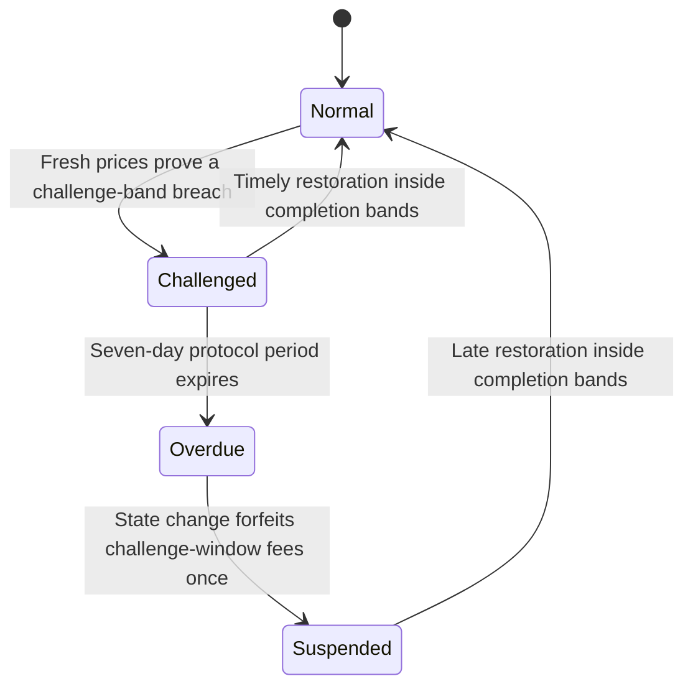

# OTF Protocol Security Specification

Status: MVP security baseline

This document defines the required security properties of the Onchain Traded Funds contracts.
`MUST`, `MUST NOT`, `SHOULD`, and `MAY` are normative requirements.

The Solidity contracts and automated checks are authoritative when this document and deployed
bytecode differ. A deployment MUST NOT claim compliance with this specification unless every
required verification gate passes for the exact commit and compiler configuration being deployed.

## 1. Security objectives

An OTF MUST:

1. Hold only its tracked constituent portfolio as accounting backing.
2. Issue and redeem shares proportionally against that portfolio.
3. Separate strategy authority from constrained trade execution authority.
4. Prevent managers and executors from making arbitrary calls or transferring portfolio assets to
   arbitrary recipients.
5. Fail closed when required oracle data is missing, invalid, incomplete, future-dated, or stale.
6. Keep strategic target changes, partial trade execution, and rebalance completion as distinct
   state transitions.
7. Preserve deposits and proportional withdrawals during challenge and fee-suspension states,
   except that deposits MUST stop after vault sunset or while either the factory-global or that
   vault's factory-local emergency deposit pause is active.
8. Make the configured strategy module immutable for the lifetime of the vault implementation.
9. Keep the vault and strategy storage layouts identical by construction.
10. Apply the same mechanical asset rules to every caller without an administrator approval,
    blocking, revocation, removal, or quality-tier authority.
11. Pin each constituent's concrete pricing source and provide no automatic fallback or
    registry-driven replacement.

## 2. Contract architecture

### `ManagedOTFVault`

The vault is the custody and share-accounting boundary. It:

- Holds constituent tokens.
- Stores all mutable OTF state.
- Issues the ERC-20 OTF share.
- Exposes ERC-1046 token metadata whose image is an embedded SVG returned through the factory.
- Handles proportional contribution and withdrawal.
- Accrues protocol and manager fee shares.
- Exposes ERC-7621-compatible views, actions, and events.
- Routes only an explicit set of state-changing and read-only strategy selectors to the fixed strategy module.

The vault fallback MAY delegate the explicitly allowlisted strategy-history views and MUST reject
every other unknown selector.

### `ManagedOTFVaultStrategy`

The strategy module contains:

- Manager fee-rate changes.
- Executor authorization changes.
- Weight-band changes.
- Strategy-rationale staging and version history.
- Manager fee withdrawal orchestration.
- Strategic target proposals.
- Constrained partial trade execution.
- Rebalance completion.
- Exact-zero manager-directed removal pruning.
- Challenge creation, resolution, and deadline synchronization.

The module executes using `delegatecall`, so it operates on the calling vault's storage and
preserves the original external caller.

The module MUST reject direct calls made against the module contract itself.

### `ManagedOTFVaultStorage`

This abstract contract is the sole canonical persistent-storage definition for both the vault and
strategy module.

- Both contracts MUST inherit it.
- Derived contracts MUST NOT declare additional non-immutable state.
- Existing fields MUST NOT be reordered, removed, or have their types changed.
- New persistent fields MUST be appended to this base only.
- Any storage-layout change requires a new security review and complete test run.

### `PortfolioCalculator`

The calculator is stateless. Every security-sensitive vault valuation MUST identify the vault and
read the concrete normalized feed and parameters pinned in that vault's state. Unbound compatibility
preview helpers MAY read a trusted registry, but no vault transition may use that live mapping. The
calculator MUST NOT transfer assets, approve spenders, or mutate vault state.

### Pricing validation contracts

`AssetPricingResolver` validates a caller-supplied `AssetPricingConfig` when an asset first enters an
OTF. It MUST support exactly direct Chainlink, composed asset/WETH × WETH/USD Chainlink, and
Uniswap V3 TWAP. `OracleRegistry` is a trusted base/quote relationship map used only during a new
Chainlink selection. `AssetMarketRegistry` validates and records canonical V3 pools used during a
new TWAP selection. `AssetRegistry` is an optional permissionless discovery index only.

The resolver MUST return a concrete normalized feed or V3 wrapper that the OTF pins. Later oracle
mapping changes and V3 market deprecation MUST NOT redirect or disable an existing pin. None of
these registries MAY determine asset eligibility, execution paths, or execution fee tiers.

### `RebalanceExecutor`

The executor is a settlement boundary called only by factory-recognized OTFs. It:

- Verifies that the adapter is approved.
- Pulls the exact approved input amount.
- Calls the typed adapter swap function.
- Measures output by balance delta.
- Returns output to `msg.sender`, which MUST be the OTF.

It MUST NOT accept a caller-selected output recipient.

### `OTFEntryRouter` and entry adapters

The optional entry router spends a fixed amount of the configured settlement token and mints the
largest proportional OTF basket supported by the assets actually received. It is outside the
vault's custody and strategy authority boundaries. It MUST:

- Accept only vaults registered by the configured factory.
- Allocate the complete fixed settlement input across the live basket in one atomic transaction.
- Use only entry adapters approved in the router's independent allowlist.
- Give each adapter an explicit exact input and minimum output.
- Verify adapter-reported and observed output balance deltas.
- Mint through the vault's proportional `mintWithBasket` function and verify returned amounts.
- Enforce the user's minimum shares, convert surplus constituents under protected refund rates,
  and return the settlement proceeds to the payer.
- Redeem an exact approved share amount through the vault's proportional exit before performing any settlement swaps.
- Enforce per-leg and aggregate minimum settlement outputs for atomic settlement-token exits.
- Never change targets, fees, roles, challenge state, or rebalance state.

An entry adapter MAY use a multi-hop venue path. A rebalance adapter MAY similarly route through
USDG internally, but the vault-visible rebalance endpoints MUST remain active constituents and the
final output MUST return to the vault through `RebalanceExecutor`.

## 3. Delegatecall requirements

The strategy delegation boundary MUST satisfy all of the following:

1. The module is deployed in the vault implementation constructor.
2. The module address is stored as an immutable.
3. There is no setter, upgrade function, beacon, or governance replacement path.
4. The module's runtime code hash is captured as an immutable at construction.
5. Every delegated call verifies the current module code hash against the expected code hash.
6. The delegation target is never read from calldata or manager-controlled storage.
7. Only explicit vault wrapper functions may invoke delegation.
8. Revert data and return data are forwarded unchanged.
9. The module and vault use the same reentrancy slot from the canonical storage base.
10. Module-to-vault callbacks MUST require `msg.sender == address(this)`.

The following selectors are allowed to delegate:

| Selector | Required authority |
| --- | --- |
| `setNextStrategyRationale(string)` | Manager |
| `proposeStrategy(address[],uint256[],string)` | Manager |
| `setManagerFeeBps(uint16)` | Manager |
| `setExecutor(address,bool)` | Manager |
| `setWeightBands(uint16,uint16)` | Manager |
| `rebalance(address[],uint256[])` | Manager |
| `activatePendingStrategy()` | Manager |
| `cancelPendingStrategy()` | Manager |
| `executeRebalanceTrades(TradeInstruction[])` | Manager or authorized executor |
| `completeStrategicRebalance()` | Permissionless |
| `flagOutOfBand()` | Permissionless |
| `resolveOutOfBandChallenge()` | Permissionless |
| Strategy-history getters | Read-only |

No generic `execute(address,bytes)`, `delegate(address,bytes)`, or equivalent selector is allowed.

## 4. Authority model

### Protocol owner

The protocol owner MAY:

- Approve or remove trade adapters.
- Set the protocol-wide minimum target weight within its hard bounds.
- Permanently identify the OTF protocol token and change or disable its full-rebate threshold.
- Reversibly pause creation and all direct or routed primary deposits globally.
- Reversibly pause direct or routed primary deposits for one factory-created OTF. The setter MUST
  reject a non-factory target.
- Transfer registry or factory ownership using their defined controls.

The trusted-oracle-route owner MAY configure an exact `(base, quote) -> feed`, protocol staleness
bound, and validation mode for future Chainlink selections. The V3 market-registry owner MAY
deprecate a pool for future selections. Such updates MUST NOT replace or disable an existing OTF's
pinned source. No protocol role MAY approve, qualify, block, revoke, or remove an asset.

The protocol owner MUST NOT:

- Transfer assets from an OTF.
- bypass OTF share-holder redemption rules.
- shorten an existing OTF cooldown.
- replace an OTF's strategy module.
- force an OTF target, disable proportional withdrawal, or suspend fee accrual using a deposit
  pause.

### Protocol treasury

`FeeCollector` is the sole source of truth for the protocol treasury. The factory MAY expose
collector-backed treasury views but MUST NOT maintain independent treasury-transfer state.
Treasury transfer MUST use the collector's two-step acceptance flow.

### Manager

Each OTF has exactly one manager. The manager MAY:

- Select constituents, target weights, and allowed weight bands.
- Change the manager fee within the protocol maximum.
- Add and remove authorized executors.
- Receive execution permission automatically, remove or restore their own permission, and execute
  constrained trades while authorized.
- Propose target changes with an inseparable strategy rationale.
- Supply a valid pricing configuration when proposing a previously unpriced asset.
- Start manager and fee-recipient transfers.

The manager MUST NOT:

- Make arbitrary external calls from the OTF.
- Transfer constituent assets to an arbitrary recipient.
- approve arbitrary spenders.
- use mechanically invalid assets or unapproved trade adapters.
- replace the source already pinned for an existing asset.
- bypass oracle, slippage, NAV-loss, or target-improvement checks.
- shorten the immutable target-change cooldown.

The manager remains accountable for challenge, forfeiture, and caller-reward outcomes regardless
of whether the manager or an executor submitted a trade.

### Authorized executor

The manager MUST be authorized automatically at OTF initialization and after manager transfer. The
manager MAY remove or restore their own executor permission and MAY authorize multiple additional
executors, subject to the protocol cap.

An executor MAY only call `executeRebalanceTrades` and permissionless functions available to any
address. It MUST NOT:

- Change constituents, weights, bands, fees, strategy rationale, manager, or fee recipient.
- Add or remove executors.
- choose a settlement recipient.
- withdraw OTF assets.
- make arbitrary calls or approvals.
- receive a bounty or reimbursement from OTF assets.

All prior executor authorizations MUST be cleared whenever the manager changes through either
ownership transfer path. The new manager MUST then become the sole authorized executor.

### Share holder

A share holder MAY:

- Contribute the exact proportional live basket.
- Transfer OTF shares.
- Withdraw the proportional live basket.

Contributions and withdrawals MUST remain enabled during active or overdue challenges. A vault
sunset or either factory deposit pause MAY disable contributions, but MUST NOT disable withdrawals,
standard share transfers, strategy operations, challenges, or fee accrual.

## 5. Portfolio and trade invariants

For every successful constrained trade batch:

1. Every `tokenIn` and `tokenOut` is a current constituent.
2. Every output has a positive target; an input has a positive target or is already at a
   manager-directed zero target.
3. Every adapter is approved by the factory.
4. The input amount is nonzero and input differs from output. A full-balance sentinel is valid only
   for a zero-target input asset with a nonzero live balance.
5. Required oracle prices are valid and fresh.
6. Explicit adapter output is at least `minAmountOut`.
7. Every leg's oracle-valued output loss is included in the batch execution loss.
8. The batch execution loss is the greater of gross per-leg oracle loss and net portfolio NAV loss.
9. Adding the batch execution loss does not exceed the linearly replenishing `maxNavLossBps` budget.
10. Consumed capacity returns continuously over seven days; profitable trade does not restore it.
11. Total portfolio distance from target strictly decreases.
12. No individual constituent moves farther from its target.
13. Output returns to the OTF.
14. Temporary input approval is exact and is cleared after execution.
15. The executor and adapter retain no unintended portfolio balance.
16. Adapter data describes an explicit execution route and MUST NOT be decoded as a pricing market
    ID. The route's pools, intermediates, and fee tiers MAY differ from the pinned price source.
17. A V3 adapter validates the exact path endpoints, requires its immutable settlement token exactly
    once, reconciles router-reported and observed deltas, and clears its allowance.

If any final check fails, the complete transaction MUST revert, including token transfers and
approvals.

Multiple partial transactions MAY be used to reach one target. Each transaction MUST independently
satisfy every invariant above, and its execution loss consumes capacity from the shared replenishing
bucket. A charge equal to the full configured budget takes seven days to recover completely.

`navLossBudgetState()` reports when the currently consumed capacity will be fully replenished,
current usage rounded up to a whole basis point, and the configured maximum. Each execution record
stores the rounded `navLossBudgetUsedBps` observed after that batch.

For every successful settlement-token entry:

1. The fixed settlement input and minimum share output are nonzero.
2. The deadline has not expired.
3. The OTF is registered by the configured factory.
4. The swap array exactly matches the live constituent array.
5. Every non-settlement leg uses an independently approved entry adapter.
6. The sum of per-leg settlement inputs exactly equals the user's fixed input.
7. Every acquired constituent satisfies its minimum output.
8. The largest supported proportional basket is deposited atomically and mints at least the user's minimum shares.
9. Temporary vault approvals are cleared after successful execution.
10. Surplus constituents satisfy their minimum refund rates and the resulting settlement tokens are returned to the payer.

AMM price and oracle NAV equality is intentionally NOT an invariant. The entrant selects a fixed
settlement input and minimum share output; the vault protects existing holders by accepting only
the proportional basket.

For every successful settlement-token exit, the router MUST verify the OTF is factory-registered,
validate all adapters before burning shares, receive exactly the basket amounts reported by the
vault, return every swap output to itself, satisfy every per-leg minimum and the aggregate minimum,
and transfer the exact aggregate settlement output to the selected receiver. Any failure MUST
revert the share burn, basket transfers, swaps, and approvals atomically.

## 6. Strategy lifecycle

### Target proposal

`proposeStrategy(newTokens, newWeights, rationale)` records a pending target and rationale using
already-pinned asset pricing. `proposeStrategyWithPricing(newTokens, newWeights, pricingConfigs,
rationale)` MUST be used when the proposal introduces a previously unpriced asset. Existing assets
MUST repeat their pinned configuration exactly. Draft ERC-7621 callers MAY instead stage the
rationale with `setNextStrategyRationale` and consume it through `rebalance(newTokens, newWeights)`,
but that two-argument selector MUST NOT introduce a previously unpriced asset. No proposal changes
the active target, implies that trades ran, or implies that reserves match the proposed target.

A proposal requires:

- Manager authority.
- A non-empty rationale no longer than 2,048 bytes.
- A semantic constituent or weight change; identical and reorder-only targets MUST revert.
- The configured portfolio cooldown and fixed 14-day strategy cooldown to have elapsed.
- No active challenge.
- No unfinished strategic rebalance.
- The previous target's completion bands to be satisfied.
- Valid portfolio shape, deployed exactly-18-decimal assets, no duplicates, caps, and one aligned
  pricing configuration per proposed asset.
- A new direct or composed Chainlink configuration that matches every exact trusted pair, or a new
  V3 configuration that passes canonical-factory, exact pair/fee, initialization, observation
  capacity, and full-history validation.
- At least one constituent, with every included target at or above the factory's live protocol-wide
  minimum target weight. That minimum has a permanent floor of 100 basis points (1%); the factory
  owner MAY raise it up to 10,000 basis points or reduce it back to the floor. Changes apply only when
  an initial or proposed target is validated and MUST NOT invalidate an active portfolio or trigger
  a challenge retroactively.
- The union of positive-target and zero-target assets awaiting manager-directed removal MUST NOT
  exceed 100 tracked assets.
- Any constituent omitted from the proposal remains tracked at a zero target until its reserve is
  liquidated exactly to zero after activation.
- Proposed turnover is calculated for the eventual strategy-history record but does not block the proposal.

It locks the rationale, emits `TargetWeightsProposed`, and leaves canonical strategy history
unchanged. The standard `Rebalanced` event MUST NOT be emitted until the target becomes active.

### Delayed activation

The active constituents and target weights MUST remain unchanged for at least 48 hours after a
proposal. Deposits and proportional redemptions MUST remain available during this notice period.
After the deadline, only the manager MAY call `activatePendingStrategy()`. Activation MUST
revalidate mechanical asset requirements, pinned-source freshness, portfolio shape, challenge state, fee state,
and completion bands before changing the active target. It emits the standard `Rebalanced` event
and `TargetWeightsActivated`, appends the canonical strategy version and target snapshot, but
performs no trades. Only the manager may cancel a pending proposal, and manager transfer MUST
cancel any proposal authored under the previous authority without appending history.

### Trade execution

The manager or an authorized executor MAY submit multiple constrained partial trade batches toward
the current target.

### Manager-directed constituent removal

There is no registry revocation, administrator renormalization, or administrator-driven shutdown.
A constituent leaves only through the normal delayed strategy process: the manager proposes a new
10,000-bps target set, the omitted asset remains tracked at zero target after activation, constrained
trades sell it down, and it is pruned after its balance reaches the permitted bound. ERC-7621
discovery, contribution previews, and withdrawal previews MUST preserve the complete live redemption
basket and ordering until pruning.

To make a final sale atomic with pruning, the manager or an authorized executor MAY set
`TradeInstruction.amountIn` to `type(uint256).max` only for a zero-target input asset. The vault MUST
resolve the full live balance inside that transaction and use the resolved amount consistently for
approval, adapter execution, emitted amounts, oracle and NAV-loss checks, and post-trade pruning. The
sentinel MUST revert for a positive-target asset or an empty balance.

`MAX_RETIRING_DUST` is fixed at `1e9` raw units per removed asset. Because mechanical validation
accepts only 18-decimal constituents, this writes off at most `1e-9` whole tokens: $0.001 at a
$1,000,000 unit price and $0.01 at a $10,000,000 unit price. This per-asset bound is an explicit
protocol risk acceptance.

### Completion

`StrategicRebalanceCompleted` MUST be emitted only after actual oracle-valued portfolio weights are
inside every completion band and every zero-target constituent has a raw balance no greater than
`MAX_RETIRING_DUST`. A successful strategic trade batch that reaches those conditions MUST prune
zero-target constituents and complete atomically after all final trade safety checks. Permissionless
explicit completion remains available when no trade is required or natural price movement restores
the portfolio. Completion marks the activated strategy version complete and is the only point that
updates `lastCompletedStrategyTimestamp`;
proposals, failed trades, and partial trades MUST NOT update it.

An active strategy alone MUST NOT suspend accrual or manager-fee withdrawals. A proven challenge
breach escrows challenge-window fees; timely recovery releases them to the manager. Sunset
checkpoints the final interval and permanently stops future accrual.

## 7. Challenge and fee accountability

Anyone MAY flag a challenge only when fresh oracle-valued weights prove that at least one
constituent is outside its challenge band.

Every vault MUST use the protocol-wide seven-day challenge grace period. The fixed period spans
scheduled equity-market weekends and typical holiday closures while keeping OTFs comparable.



During a challenge:

- Target changes are locked.
- Manager-fee withdrawals are locked while the challenge is active.
- Corrective constrained trades remain available and MUST resolve the challenge atomically when
  their final fresh oracle-valued weights are inside every completion band.
- Natural price recovery MAY restore compliance.
- Contributions and withdrawals remain available.

### Manager sunset state

The manager MAY permanently sunset an operational OTF. Manager sunset MUST revert until the current strategy
cooldown has ended and while a challenge, pending strategy proposal, or strategic rebalance is
active. The transition MUST checkpoint the final valid
fee interval before recording its timestamp. After sunset:

- Contributions and basket mints MUST revert.
- Future manager and protocol fee accrual MUST be zero.
- New challenges, target proposals, activations, cancellations, and constrained trades MUST revert.
- Proportional withdrawals, redemptions, challenge-reward claims already earned, and ERC-20 share
  transfers MUST remain available.
- The sunset flag and timestamp MUST remain publicly readable and the transition MUST be
  irreversible.

The factory owner MAY call `setDepositsPaused(bool)` to set or clear one protocol-wide deposit
pause. New OTF creation and every direct or routed primary deposit MUST revert while it is active.
The owner MAY also call `setVaultDepositsPaused(vault, bool)` to set or clear one local pause; the
factory MUST reject targets it did not create. Every vault and entry router MUST observe both live
flags at deposit execution, and deposits are enabled only when both are clear.

The factory MUST expose `vaultDepositsPaused(vault)` and emit
`VaultDepositsPauseChanged(vault, paused)` for local changes. Neither pause MUST affect withdrawals,
redemptions, transfers, secondary-market share trades, strategy operations, challenges, or fee
accrual. No asset status or registry change MAY trigger manager sunset or either pause.

Starting a challenge MUST first crystallize the entire valid fee interval through the challenge
start timestamp. This applies whether `flagOutOfBand()` or a manager fee-withdrawal attempt detects
the breach. Previously earned or minted fees MUST NOT be included in later challenge forfeiture.

If the portfolio is restored inside every completion band on or before the deadline, the challenge
caller MUST receive no reward. The manager receives the full unminted fee interval from challenge
start through timely resolution, and the fee timestamp MUST prevent any interval from being minted
twice.

If the grace deadline is observed after expiry:

- Manager fees from the challenge window are forfeited.
- 50% of the forfeited amount becomes a claimable reward for the challenge caller.
- The remaining 50% is never minted.

Forfeiture and reward balances update only when a state-changing transaction first processes an
overdue challenge; they do not increase automatically with wall-clock time. The forfeiture interval
MUST end at the recorded deadline, and processing MUST be an idempotent one-time transition for the
active challenge. `claimChallengeReward()` MAY process that transition before reading the caller's
reward balance. It MUST checkpoint any normally accruing fee interval against the pre-reward share
supply before minting the full reward balance and resetting it to zero. Later calls and other
accrual paths MUST NOT increase either the forfeiture total or the caller reward for the same
challenge. No separate deadline-synchronization entry point is required.

Restoration to completion bands resumes only future manager-fee accrual.

Executors receive no protocol-funded compensation. A manager MAY compensate an executor outside
the OTF from the manager's own assets or fee revenue.

## 8. Share-accounting invariants

1. Every operational state-changing entry point MUST revert before successful initialization.
2. Initialization MUST be non-reentrant.
3. Constituent-token callbacks during factory prefunding MUST NOT mint shares, change roles, or
   mutate strategy state at the clone's predicted address.
4. Initial supply MUST exceed the permanently locked minimum-liquidity shares.
5. Total supply MUST never return to zero.
6. Contributions MUST be proportional to current reserves and supply.
7. Contribution requirements round up.
8. Withdrawal outputs round down.
9. User-specified maximum inputs and minimum outputs MUST be enforced.
10. Sender and receiver balance deltas MUST equal expected amounts.
11. Fee-on-transfer, sender-taxed, and incompatible rebasing behavior MUST revert.
12. Tracked-asset donations become backing for all shares and MUST NOT create privileged claims.
13. Unsupported-token donations are excluded from accounting and cannot be rescued by the manager.
14. Fee growth MUST compose across time partitions so discretionary checkpoint cadence cannot
    materially change total fee dilution.
15. The configured annual rate MUST equal holder dilution over one full 365-day fee year.
16. Contributions, basket mints, withdrawals, redemptions, and reward mints MUST checkpoint normally
    accruing fees against the pre-change supply.
17. Fee-rate changes MUST close the old-rate interval at the transaction timestamp even if the
    resulting fee is less than one share-wei; the new rate MUST apply only to future time.
18. Fractional fee-share and protocol-split remainders MUST be retained across ordinary checkpoints.
19. Fee calculations MUST NOT cap elapsed time and then advance past an unprocessed remainder.
20. Sunset MUST checkpoint fees once at the transition timestamp and MUST prevent every later fee
    preview or accrual from extending that interval.

## 9. Oracle requirements

`PricingSource` MUST contain exactly `ChainlinkDirect`, `ChainlinkAssetWeth`, and
`UniswapV3Twap`. A zero/default enum value is not sufficient validation: every required address and
relationship MUST be checked. Uniswap V4 and every other source type MUST be rejected.

For direct Chainlink pricing:

- `primarySource` MUST be the trusted feed for the exact `(asset, USD)` pair.
- `secondarySource` MUST be zero.
- Pair identity MUST come from a trusted onchain base/quote mapping, never `description()`.

For composed Chainlink pricing:

- `primarySource` MUST be the trusted feed for exact `(asset, WETH)`.
- `secondarySource` MUST be the trusted feed for exact `(WETH, USD)`.
- Reversed legs and a correct feed under the wrong pair key MUST revert.
- Both feeds, staleness bounds, and validation modes MUST be pinned in the normalized wrapper.
- Every read MUST validate both legs independently and MUST expose the older leg's timestamp.
- The multiplication and decimal normalization MUST be overflow-safe and return a nonzero USD price.

Every Chainlink leg MUST reject missing code, nonpositive answers, zero or future timestamps,
incomplete rounds, answers beyond its protocol-defined staleness bound, and unsupported decimals.
When a leg uses `RobinhoodStockToken` validation, the base token's `oraclePaused()` call MUST be
available and false. Robinhood equity feeds publish 24/5 and already include the token
`uiMultiplier()`; the protocol MUST NOT apply it again.

Chainlink's Robinhood [Flags Contract Registry](https://docs.chain.link/data-feeds/contract-registry)
proves only whether a proxy is currently official and active. It does not prove pair orientation,
and no Robinhood deployment of the older pair-addressed Feed Registry is documented. Production
MUST therefore independently verify Flags status where available and maintain the exact trusted
onchain pair map, or reject Chainlink selection. The current contracts do not consume Flags or an
L2 sequencer-uptime feed at runtime; both limitations MUST be resolved or explicitly accepted by a
fresh production review. See [Robinhood's oracle guidance](https://docs.robinhood.com/chain/oracles-and-price-feeds).

For V3 TWAP pricing:

- `primarySource` MUST be a pool returned by the configured canonical factory's `getPool` for the
  exact asset/quote pair and exact onchain fee.
- The quote MUST be WETH or USDG. If WETH is used, the configured canonical WETH/USDG pool supplies
  the USD bridge.
- `secondarySource` MUST be zero.
- The pool MUST be initialized, use a supported fee tier, have at least the protocol observation
  capacity, and answer the full protocol TWAP-window observation before selection.
- The concrete pool and normalized wrapper MUST be pinned. Later market deprecation MAY block only
  future selection and MUST NOT affect an existing OTF.

Every source is fail-closed and has no automatic fallback. Pricing registries are consulted only
when a source is first selected. The frontend MUST NOT substitute cached/offchain prices for onchain
enforcement, and database catalog entries or prefills MUST NOT count as validation.

## 10. ERC-7621 status

The conformance baseline is the official Ethereum ERCs repository:

- [ERC-7621 draft specification](https://github.com/ethereum/ERCs/blob/2bc5bccf25aa06f98644c35fc92e6bf82947cfe2/ERCS/erc-7621.md)
- [Official draft interface and reference assets](https://github.com/ethereum/ERCs/tree/2bc5bccf25aa06f98644c35fc92e6bf82947cfe2/assets/erc-7621)

The pinned upstream snapshot is commit `2bc5bccf25aa06f98644c35fc92e6bf82947cfe2`.
ERC-7621 remains a draft, so any upstream change requires a new compatibility review.

The OTF exposes the pinned draft ERC-7621 function surface, interface ID `0xc9c80f73`,
ERC-173 ownership surface, and exact standard events:

- `Contributed`
- `Withdrawn`
- `Rebalanced`

Custom events supplement rather than replace standard events.

The implementation intentionally restricts contributions to an exact proportional live basket.
Increasing only one constituent can therefore make a contribution invalid instead of producing
monotonically non-decreasing shares. `totalBasketValue` reports a decimal-normalized sum of current
reserves, while contribution previews use proportional reserve-to-supply accounting rather than a
generalized valuation of arbitrary contribution vectors. These are intentional behavioral
deviations from the current draft.

The implementation also prevents ownership renunciation, as the draft expressly permits to avoid
permanent management lockout, and requires a constituent reserve to reach zero before removal.
Factory initialization always establishes nonzero locked liquidity before public contributions.

The project MUST describe itself as ERC-7621 interface-compatible with documented restrictions and
MUST NOT claim full or unconditional ERC-7621 compliance.

## 11. Required verification gates

Before deployment, the exact commit MUST pass:

```bash
corepack pnpm contracts:security
cd contracts
forge fmt --check
forge build
forge test
forge test --match-contract ProtocolFuzzTest -vv
forge test --match-contract ProtocolInvariantTest -vv
```

`contracts:security` MUST verify:

- Production Solidity passes Foundry lint with warnings denied and the independent Solhint
  security rules with zero findings.
- Vault storage equals the canonical storage-base layout.
- Strategy storage equals the canonical storage-base layout.
- Every production runtime is at most 24,576 bytes.
- Every production initcode is at most 49,152 bytes.
- The vault ABI has no generic `execute`.
- The asset-discovery ABI has no owner, status, approval, block, revocation, or removal method.
- The vault ABI has no registry-driven terminal-shutdown or market-config proposal method.
- The generic V3 adapter has no `marketIdFromData` or pricing-registry dependency.
- The factory ABI exposes global and local deposit-pause controls and the local pause event.
- The factory `createVault` tuple contains `initialPricingConfigs` and not `initialMarketIds`.
- The pricing source enum and production contract set include the direct/composed/V3 resolver and
  wrappers and expose no V4 source.
- The strategy ABI has no initializer or upgrade surface.
- The local ERC-7621 function selectors, interface ID, events, and errors match the pinned official
  draft, and the vault ABI contains every required item.
- Module identity and code-hash views remain exposed.

The full suite MUST include deterministic, fuzz, invariant, malicious-token, executor-boundary,
delegatecall-context, direct/composed/spoofed/reversed/no-fallback oracle, canonical V3
factory/history, price-versus-execution separation, local/global pause, challenge, fee-state, and
ERC-7621 event tests.

## 12. Deployment and change control

Every deployment record SHOULD include:

- Git commit.
- Solidity compiler version.
- Optimizer and IR settings.
- Chain ID.
- Factory, implementation, strategy module, calculator, executor, discovery registry, trusted oracle
  route registry, V3 market registry, pricing resolver, adapter, and treasury addresses.
- Canonical V3 factory, WETH, USDG, WETH/USDG pool, supported fees, TWAP window, observation
  capacity, and verified history evidence.
- Every trusted Chainlink base/quote/feed relationship, staleness bound, validation mode, official
  Flags status where available, and the source used for that evidence.
- Every initial per-asset pricing configuration and the concrete normalized feed or pool pinned by
  each created OTF.
- Runtime code hashes.
- Test and security-command results.
- Independent audit report references.

For production, factory, trusted-oracle-route, V3-market, and treasury authority MUST be assigned to
reviewed multisig or timelocked governance contracts rather than EOAs. Operational and treasury
signers SHOULD be separated, and all pending administrative changes MUST be monitored.

This architecture requires a fresh deployment. Existing non-upgradeable vault clones and their
factory cannot acquire pinned pricing storage, `initialPricingConfigs`, generic adapter data, or
per-vault pause semantics. Deployment tooling MUST archive the legacy address record and MUST NOT
present an old factory as migrated. The `VaultInitParams` tuple and deterministic clone salt have
changed, so predicted addresses from the legacy architecture are invalid.

Any change to storage, delegation, authorization, token movement, fee math, oracle validation,
adapter execution, or challenge logic requires a fresh security review.

Passing this specification and its automated checks reduces known implementation risk. It does not
replace an independent professional audit, deployment review, monitoring, incident procedures, or
economic analysis.
